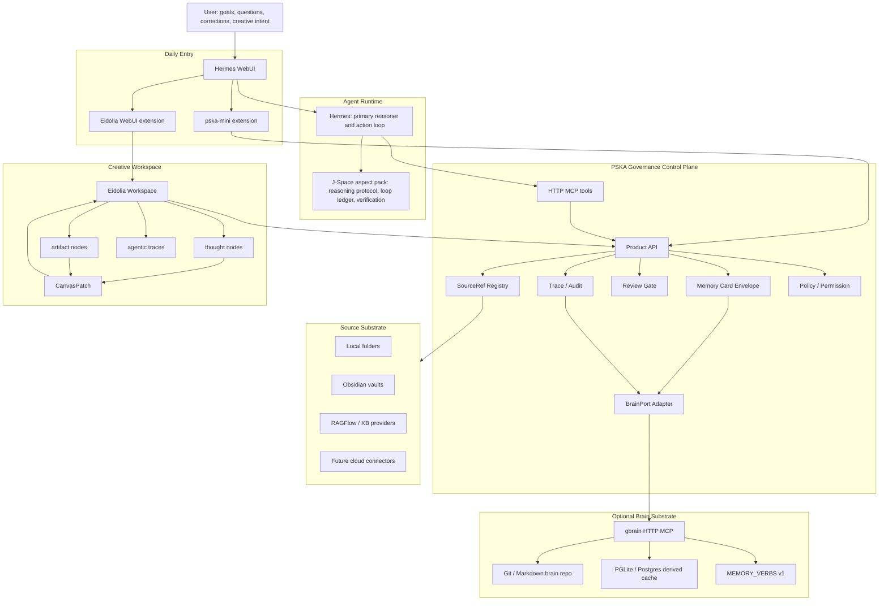

# Eidolia、gbrain、J-Space 与 PSKA 演化研究

日期：2026-08-17

## 结论

这三个项目应该放在不同层次里看：

```text
Eidolia 是创作工作面：thought / artifact / CanvasPatch / trace。
gbrain 是长期 brain substrate：Git/Markdown system of record + PGLite/Postgres + MCP memory verbs。
J-Space 是 inference-time cognitive aspect：推理时工作空间控制协议 + 可选任务 ledger controller。
PSKA 是治理控制面：SourceRef、Memory Card envelope、Review、Policy、Audit、Trace、Hermes WebUI extension。
```

因此推荐方向不是把四者揉成一个大应用，而是：

1. 保持 Hermes WebUI 为唯一日常入口，PSKA 不另立独立前端。
2. 保持 Eidolia 只有 `thought` / `artifact` 两类用户可见节点。
3. 把 gbrain 作为可选 `BrainPort` provider，不作为 PSKA core 依赖。
4. 把 J-Space 作为 Hermes/PSKA 的 `CognitiveAspectPack`，影响 agent 的运行协议，不保存用户长期记忆。
5. 所有外部组件进入 PSKA 前必须归一化成 `SourceRef`、Memory Card proposal、Review、Trace。

一句话：

> PSKA 不需要变成 gbrain 或 J-Space；PSKA 应该学会治理它们。

## 证据范围

本轮检查的主要本地证据：

| 项目 | 检查文件 | 关键发现 |
| --- | --- | --- |
| PSKA | `/Users/xudawei/PSKA-Essential/docs/SYSTEM_INTERACTION_MODEL.zh.md` | Hermes 是唯一日常 Reasoner；PSKA 不做 chat、不拥有生成 LLM；Eidolia 是创作画布，不是第二聊天入口。 |
| PSKA | `/Users/xudawei/PSKA-Essential/docs/FRONTEND_BOUNDARY_AUDIT_2026-08-15.zh.md` | PSKA v1 不应有独立用户前端；入口是 Hermes WebUI extension。 |
| PSKA | `/Users/xudawei/PSKA-Essential/docs/PSKA_AGENTIC_SYSTEM_UPGRADE_PLAN.zh.md` | 当前已具备 SourceRef、Memory Card、Review、Trace、Eidolia bridge、Agentic Context Brief 等控制面骨架。 |
| PSKA | `/Users/xudawei/PSKA-Essential/src/pska_essential/mcp_server.py` | PSKA MCP 默认 `streamable-http`，端口 `8766`，`stdio` 只应作为隔离 registry 检查。 |
| Hermes config | `/Users/xudawei/.hermes/config.yaml` | 当前 `pska-essential` 通过 `http://127.0.0.1:8766/mcp` 接入 Hermes。 |
| Eidolia | `/Users/xudawei/novel/README.md` | Eidolia 是本地创作画布工作台，项目保存主稿、画布、草稿、设定库、大纲、agentic traces。 |
| Eidolia | `/Users/xudawei/novel/docs/eidolia-agent-architecture.md` | `Workspace` 是唯一画布事实状态；`Trace` 是审计日志；`Candidate` 必须经 `CanvasPatch` 才能落盘。 |
| Eidolia | `/Users/xudawei/novel/docs/eidolia-node-ontology.md` | 长期节点模型只有 `thought` 和 `artifact`；`Ask PSKA` 应收敛为只读 evidence action。 |
| gbrain | `/Users/xudawei/PSKA-Components/gbrain/README.md` | gbrain 是 Postgres/PGLite brain，支持 CLI、MCP、HTTP MCP、hybrid search、jobs、skills、brain repo。 |
| gbrain | `/Users/xudawei/PSKA-Components/gbrain/docs/architecture/system-of-record.md` | Git/Markdown 是 system of record；DB 是 derived cache；facts/takes/links/timeline/tags 有 FS-canonical 合约。 |
| gbrain | `/Users/xudawei/PSKA-Components/gbrain/docs/protocol/MEMORY_VERBS_v1.md` | 冻结的 memory wire protocol：`recall`、`remember`、`entity`、`synthesize`、`forget`、`context_pack`、`delta`。 |
| gbrain | `/Users/xudawei/PSKA-Components/gbrain/docs/guides/brain-vs-memory.md` | gbrain 管 world knowledge；agent memory 管操作状态、偏好、工具配置；session 管当前对话。 |
| gbrain | `/Users/xudawei/PSKA-Components/gbrain/docs/mcp/HERMES.md` | gbrain Hermes 文档推荐 stdio MCP，这不应直接复制进 PSKA/Hermes 的产品路径。 |
| J-Space | `/Users/xudawei/J-Space-Cognition-Suite-V3.6/README.md` | 明确不改模型权重、不微调、不加隐藏服务，是 inference-time cognitive control layer。 |
| J-Space | `/Users/xudawei/J-Space-Cognition-Suite-V3.6/j-space/SKILL.md` | 以 Skill 封装，按 `fast`、`full`、`loop` 路由模块，选择性加载。 |
| J-Space | `/Users/xudawei/J-Space-Cognition-Suite-V3.6/j-space/scripts/jspace.py` | 可选标准库 controller，把 loop state 外化到 `.jspace/`，但它不决定答案。 |

验证补充：

```bash
cd /Users/xudawei/J-Space-Cognition-Suite-V3.6
python3 j-space/scripts/verify_suite.py
python3 -m unittest discover -s tests -v
```

结果：`verify_suite: clean`，5 个 controller 回归测试通过。

## 总体架构



这个图里的关键边界是：

- Hermes 负责推理和生成。
- PSKA 负责治理和证据结构化。
- Eidolia 负责创作状态，不负责长期 memory governance。
- gbrain 负责长期 brain 存储和检索，不负责 PSKA policy。
- J-Space 负责推理时控制，不负责 retrieval、memory 或 source of truth。

## Eidolia 与 gbrain 的关系

Eidolia 和 gbrain 的连接点不是 UI，而是认知对象的生命周期。

Eidolia 当前已经有很好的最小模型：

```text
thought: 念头、疑问、假设、中间结语、暂时判断
artifact: 章节、素材、证据、来源、草稿、候选结果
```

这和 gbrain 的 brain repo 可以形成互补：

| Eidolia 对象 | PSKA 归一化 | gbrain 可选投影 |
| --- | --- | --- |
| `thought/idea` | `SourceRef(adapter="eidolia")` + role `hypothesis` / `belief` | `originals/` 或 project page 的 take/fact 候选 |
| `thought/question` | SourceRef + trace event | open question / page note |
| `artifact/evidence` | SourceRef + evidence metadata | source page / cited fact |
| `artifact/draft` | SourceRef + generated_from trace | project artifact page，不自动变事实 |
| `agentic-trace` | audit-backed trace | timeline entry 或 supporting evidence |

推荐路径：

```text
Eidolia thought/artifact
  -> PSKA eidolia SourceRef
  -> PSKA Memory Card candidate or trace view
  -> Review Gate
  -> optional gbrain remember/page update
```

不要走的路径：

```text
Eidolia UI
  -> gbrain 直接写 brain repo
  -> 绕过 PSKA Review / SourceRef / Audit
```

原因是 Eidolia 的 `Trace` 只是审计日志，不是画布事实状态；`Candidate` 也不能直接等于节点。PSKA 的职责正是在这些状态之间建立可审计的晋升路径。

## gbrain 好不好

结论：gbrain 很强，而且比当前 PSKA 的底层 brain substrate 更成熟。但它不是 PSKA 的替代品。

它强在：

- Git/Markdown 作为长期 system of record，符合“几十年可携带”的个人外部大脑目标。
- PGLite/Postgres/pgvector 作为 derived cache，兼顾个人本地和规模化。
- MEMORY_VERBS v1 很适合作为跨 agent 的 memory wire protocol。
- `context_pack` 和 `delta` 很适合 session start、compaction 后恢复和跨对话连续性。
- jobs/minions/dream cycle/eval/hook/skillpack 说明它已经在“长期运行 brain”方向走得很远。

它不适合作为 PSKA core 直接替换的地方：

- 默认依赖和运行面很重：Bun、PGLite/Postgres、OAuth HTTP server、admin dashboard、AI provider、jobs 等。
- 它有自己的产品边界和 MCP 工具体系，不天然服从 PSKA 的 SourceRef/Review/Audit 合约。
- gbrain 的 Hermes 文档当前推荐 stdio MCP；PSKA 产品路径已经收敛到 HTTP MCP。
- `remember` 在 gbrain 语义里是直接写入 brain；在 PSKA 语义里长期记忆需要 Memory Card envelope 和 Review Gate。

所以最合适的定位是：

```text
gbrain = optional external brain substrate
PSKA = governance and adapter control plane
Hermes = reasoning/action loop
```

## gbrain 与 PSKA 的差异

| 维度 | gbrain | PSKA 当前方案 | 推荐关系 |
| --- | --- | --- | --- |
| 系统定位 | 个人/组织 brain runtime | 知识治理胶水层和 agent control plane | gbrain 做 substrate，PSKA 做 governance |
| Source of truth | Git/Markdown brain repo | 用户原文件、Obsidian、RAGFlow、Eidolia、SQLite stores | 不合并 source of truth，做 SourceRef 映射 |
| Memory wire protocol | MEMORY_VERBS v1 | Memory Card API/MCP、conversation memory candidates | PSKA 增加 BrainPort，适配 MEMORY_VERBS |
| 写入策略 | `remember` 可直接写 | proposal/review/apply | PSKA wraps gbrain write behind review |
| 检索 | hybrid search、BM25、vector、graph signals | no-embedding FTS5、RAGFlow、source registry | 并存，PSKA 做 route |
| 长期运行 | dream cycle、minions、hooks | jobs、audit、readiness、digest | 可借鉴或接入，但 heavy optional |
| Hermes 接入 | 文档推荐 stdio，也支持 HTTP | PSKA 默认 HTTP MCP | 产品路径只用 HTTP / adapter |
| 认知语义 | facts/takes/pages/entities | SourceRef、Memory Card、Review、Trace | PSKA 保持语义所有权 |

## J-Space 是模型增强插件吗

结论：不是“模型增强插件”，至少不是修改模型能力或权重的那种。

J-Space 自己的定义很清楚：

```text
不修改模型权重。
不要求 fine-tuning。
不加隐藏服务。
它是 inference-time cognitive control layer。
```

它实际包含两部分：

1. `j-space/SKILL.md` 和 `modules/`：选择性加载的推理协议。
2. `j-space/scripts/jspace.py`：可选标准库 controller，把任务 ledger 外化到 `.jspace/`。

它能增强 Hermes 的方式是：

- 帮 Hermes 在长任务中保持 goal、core constraints、verified checkpoints、open questions、next action。
- 在工具调用、写文件、跨 turn、compaction 后提供 seam/resume 协议。
- 让 agent 更明确地区分 inner、ledger、outer register。
- 把“想得更深”变成可执行的验证和恢复动作。

它不能提供：

- 新知识。
- 文档检索。
- 长期用户记忆。
- source of truth。
- 自动文件治理。
- 模型权重层面的能力提升。

因此 J-Space 应该作为：

```text
CognitiveAspectPack
  load_policy: by task type
  modules: capacity / broadcast / deep-reasoning / empirics / self-monitoring / ...
  controller: optional .jspace ledger for long tasks
  trace: record which aspect affected the run
```

而不是：

```text
Memory provider
RAG provider
PSKA source store
独立 agent platform
```

## PSKA 应该如何演化

### 1. 增加 BrainPort，而不是引入 gbrain core 依赖

建议在 PSKA 中定义一个 provider-neutral port：

```text
BrainPort
  status()
  recall(query, scope, budget)
  entity(name, scope)
  context_pack(entities, budget, since)
  delta(session_id, since)
  propose_remember(memory_card)
  apply_remember(review_id)
  propose_forget(memory_id_or_external_ref)
```

第一版 provider：

```text
SQLiteMemoryBrainPort: 现有 PSKA memory/search 的适配层
GBrainHttpBrainPort: 调 gbrain HTTP MCP 的 MEMORY_VERBS v1
NullBrainPort: 未配置时的清晰 degraded response
```

关键规则：

- `recall` / `entity` / `context_pack` 可以 read-only 进入 Agentic Context Brief。
- `remember` / `forget` 不能让 Hermes 直接调用 gbrain 写入。
- gbrain 写入必须由 PSKA Review Gate 后触发，并把 provenance 写成 PSKA review/source trace。
- gbrain 返回内容必须包装成 `SourceRef(adapter="gbrain")` 或 Memory Card evidence。

### 2. 把 Eidolia bridge 升级为认知晋升路径

当前 PSKA 已有：

```text
pska_eidolia_context_read
pska_eidolia_memory_review_create
pska_trace_query
pska_eidolia_project_trace_import
```

下一步不是增加 Eidolia 节点类型，而是补完整晋升路径：

```text
thought/artifact
  -> SourceRef(adapter="eidolia")
  -> trace event
  -> Memory Card candidate
  -> Review
  -> optional BrainPort write
```

Belief/Decision Ledger 也不应做成另一个大表体系。它更适合作为投影视图：

```text
Belief = thought role + Memory Card type + evidence + supersession trace
Decision = thought/artifact + source_refs + alternatives + later outcome trace
Ledger = TraceQuery over SourceRef / Review / Memory / Eidolia
```

这符合你之前想要的“不是多造节点，而是把我脑中所想具现出来”。

### 3. 把 J-Space 包成 Hermes skill/aspect

推荐集成方式：

```text
Hermes skill registry
  -> j-space entry skill
  -> selected modules by task type
  -> optional controller workspace for long tasks
  -> PSKA trace records aspect_used
```

PSKA 可以做两件事：

- 在 Agentic Context Brief 中建议本轮使用哪个 aspect，例如 `deep-reasoning`、`capacity`、`empirics`。
- 在 Trace/Audit 中记录“本轮用了哪些推理协议、产生了哪些 checkpoint、哪些检查覆盖了什么”。

PSKA 不应该做：

- 把 J-Space ledger 当长期 memory。
- 把 inner register 暴露给用户或 task-facing tool。
- 每轮强行加载所有 J-Space modules，导致控制协议反过来压垮上下文。

### 4. 保持 Hermes-first，多 agent 先做 specialist profile

gbrain 和 J-Space 都容易把系统推向“又多一个 agent”。PSKA 当前升级计划里更稳的路线是：

```text
Hermes Manager Agent
  -> Recall specialist
  -> Memory Curator specialist
  -> Trace Explainer specialist
  -> Critic / Verifier specialist
```

第一阶段这些 specialist 应该是：

- Hermes skills。
- tool bundles。
- prompt/profile。
- J-Space aspect selection。

而不是多个常驻 agent 互相抢控制权。

## 推荐实施路线

### Phase A: 文档和边界冻结

产物：

- 本文档。
- 更新 PSKA 技术方案，把 `gbrain` 和 `J-Space` 放入 optional adapter/aspect，而不是 core。
- 增加 red-line checklist：
  - PSKA 不独立前端。
  - PSKA MCP 产品路径用 HTTP。
  - Eidolia 不新增 operator 节点。
  - gbrain 不绕过 PSKA Review 写长期记忆。
  - J-Space 不作为 memory/source provider。

### Phase B: GBrainHttpBrainPort read-only

先只做读，不做写：

```text
PSKA Product API
  GET /api/brain/status
  POST /api/brain/recall
  POST /api/brain/entity
  POST /api/brain/context-pack
```

内部调用：

```text
gbrain serve --http
POST http://127.0.0.1:<port>/mcp
```

输出全部包装为：

```text
SourceRef(adapter="gbrain", source_id=<brain>, external_id=<fact/page>, metadata={...})
```

验收：

- gbrain 未启动时 PSKA degraded，不影响 core。
- Hermes 只看到 PSKA tool，不需要直接看到 gbrain。
- Agentic Context Brief 可把 gbrain recall/context_pack 作为一类 evidence source。

### Phase C: Memory Card -> gbrain write-through

只在 review accepted 后写：

```text
conversation / Eidolia / source route
  -> Memory Card candidate
  -> Review accepted
  -> BrainPort.apply_remember
  -> gbrain remember(..., provenance="pska_review:<id>")
  -> PSKA trace records external write
```

验收：

- reject 不写 gbrain。
- apply 幂等。
- provenance 可回查到 PSKA review/source refs。
- `forget` 也必须走 proposal/review，不直接删。

### Phase D: Eidolia -> PSKA -> gbrain projection

目标：

- 选中 thought/artifact 后创建 memory candidate。
- 导入 explicit Eidolia project trace 后可生成 project context pack。
- 可选择把 reviewed thought 投影到 gbrain `originals/` 或 project page。

不做：

- 不让 gbrain 直接改 Eidolia workspace。
- 不把 Eidolia project files 复制成 PSKA canonical store。
- 不在 Eidolia 新增一堆 memory/operator 节点。

### Phase E: J-Space aspect integration

目标：

- 把 `/Users/xudawei/J-Space-Cognition-Suite-V3.6/j-space` 作为可加载 skill/aspect 源。
- Hermes 长任务按需加载 `capacity`、`broadcast`、`deep-reasoning`、`empirics`、`self-monitoring`。
- 对长程任务可选运行 `jspace.py` controller，把 `.jspace/` 放在任务 workspace，而不是 PSKA core 目录。
- PSKA trace 记录 `aspect_used`、`checkpoint_count`、`verification_coverage`。

验收：

- 短任务不加载。
- 外部输出不泄漏 inner-only notation。
- controller 不写 PSKA memory。
- aspect 失败时只是 degraded，不阻塞 PSKA core。

## 风险和判断

| 风险 | 判断 | 处理 |
| --- | --- | --- |
| gbrain 过重 | 真实风险 | optional adapter，不进 core dependency。 |
| gbrain stdio 误接入 Hermes | 高风险 | 产品路径只采用 HTTP MCP 或 PSKA adapter；stdio 仅允许 isolated local check。 |
| 双 memory 系统打架 | 高风险 | PSKA Memory Card 是治理 envelope，gbrain 是 optional substrate。 |
| J-Space 被误认为模型权重增强 | 中风险 | 文档和 UI 均写成 cognitive aspect，不写成 model plugin。 |
| J-Space 过度加载导致上下文膨胀 | 中风险 | 只按 task gate 选择模块。 |
| Eidolia 被复杂化 | 高风险 | 继续只保留 `thought` / `artifact`，Belief/Decision 是投影视图。 |
| Hermes 直接同时接 PSKA 和 gbrain | 中高风险 | v1 推荐 Hermes 只接 PSKA；gbrain 通过 PSKA BrainPort 间接进入。 |

## 最小可演示闭环

如果要把这条路线变成功能演示，最小闭环可以是：

```text
1. Hermes WebUI 打开 PSKA extension。
2. 用户在 Eidolia 运行一个 thought，产生 thought/artifact 和 trace。
3. PSKA 导入 Eidolia project trace，生成 SourceRef(adapter="eidolia")。
4. Hermes 通过 PSKA Agentic Context Brief 看见 Eidolia trace、source recall、Memory Card candidate。
5. 用户 accept Memory Card review。
6. PSKA 通过 BrainPort 写入 gbrain remember，provenance 指向 PSKA review。
7. 新会话里 Hermes 通过 PSKA context_pack/recall 取回这条记忆。
8. TraceQuery 展示：Eidolia thought -> PSKA review -> gbrain fact -> Hermes answer。
```

这个 demo 能证明的不是“多接了一个工具”，而是：

```text
创作中的念头可以经过治理变成长久可召回的外部认知。
```

这正好对应 PSKA 的长期目标。
