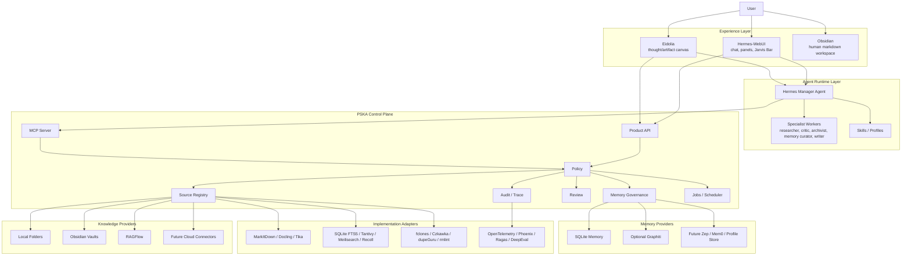

# PSKA Agentic Cognitive System Technical Proposal

更新时间：2026-08-12

## 1. Executive Summary

PSKA Agentic Cognitive System 是一个面向个人和小型高认知工作流的外部认知智能体系统。
它不是单一 RAG、聊天机器人、文件管理器或笔记软件，而是一套组合式 workspace：

```text
Hermes 负责行动和推理。
PSKA 负责知识控制、记忆治理、权限、出处和审计。
Eidolia 负责无限画布创作和 thought/artifact 工作流。
Obsidian、本地文件夹、RAGFlow 和未来云端连接器负责保存真实资料。
```

系统目标有两层：

- 当前目标：让用户在研究、写作、工程、产品设计和个人知识管理中更聪明、更有上下文、
  更少重复劳动。
- 长期目标：保存用户的知识、判断、记忆和思考轨迹，形成可追溯、可更新、可继承的外部
  认知连续性。

一句话定位：

> PSKA 是一个 source-first、memory-governed、agent-operated、canvas-native 的个人外部
> 认知系统。

## 2. Core Characteristics

| 特点 | 含义 | 与普通方案的差别 |
| --- | --- | --- |
| Source-first | 文件、Obsidian、RAGFlow、云盘仍是资料的 source of truth | 不把所有资料吞进一个黑盒知识库 |
| Memory-governed | 长期记忆必须有行为差异、证据、作用域和生命周期 | 不做空泛的“用户画像摘要” |
| Hermes-first | Hermes 是唯一主 agent，PSKA 只做控制面和工具边界 | 不让多个 agent 或 provider 抢回答权 |
| Canvas-native | Eidolia 用 `thought` / `artifact` 承载创作、推演和结构化思考 | 不把所有智能交互都压成聊天气泡 |
| No-embedding-first | 本地文件夹和 Obsidian 第一版优先用 metadata、BM25、hash、links | 不把 embedding 当成本地知识管理的前提 |
| Traceable | 回答、记忆、写回、整理建议都有 SourceRef 和 Audit | 用户能知道系统为什么这么做 |
| Governed Automation | 自动化先生成 proposal、review、next action，再按权限 apply | 不偷偷扫全盘、改笔记、删文件或写记忆 |
| High-Cognition-first | 首先让现在的用户更强，而不是只做未来的辅助模式 | 认知连续性来自日常增强，而不是事后补档 |
| Adapter-first | 解析、搜索、查重、同步、可观测性尽量复用开源组件 | PSKA 自建语义和治理，不重复造底层轮子 |

## 3. Target Users

### 3.1 Primary Users

| 人群 | 典型痛点 | PSKA 提供的价值 |
| --- | --- | --- |
| 研究者、博士生、独立学者 | PDF、笔记、引用、想法和项目线索分散 | 跨文件夹/vault 查询、source route、决策轨迹、研究 brief |
| 工程师、独立开发者 | 项目上下文、设计决策、handoff 和代码资料容易断裂 | 恢复项目状态、定位旧决策、生成技术方案、维护 source routes |
| 产品经理、创业者 | 需求、用户反馈、竞品、战略判断持续变化 | 记录判断依据、跟踪纠错、把会议/文档转成可追溯记忆 |
| 作家、创作者、游戏/世界观设计者 | 灵感、草稿、设定、素材和版本散落 | Eidolia 画布创作、artifact 生成、设定一致性、记忆化风格偏好 |
| 高强度知识工作者 | 上下文切换多、长期项目多、重复解释多 | Jarvis briefing、跨对话记忆、任务/资料下一步提示 |

### 3.2 Secondary Users

| 人群 | 适配方式 |
| --- | --- |
| 小型团队 | 可共享部分 source roots、project memory 和审计记录，但个人记忆默认私有 |
| 法律、咨询、金融等证据密集型工作者 | 强化 SourceRef、引用、Review、权限和不可篡改 audit |
| 需要 local-first 或隐私优先的用户 | 本地文件夹、SQLite、Obsidian、可选本地解析与检索 |
| 认知负担较高或长期项目跨度很大的人 | 用 Memory Card 和 Trace 恢复上下文，降低重启成本 |

### 3.3 Non-Target Users

- 只需要普通闲聊或一次性问答的轻量用户。
- 希望 AI 自动接管全部文件、邮件、日历并自由执行的人。
- 只想要一个企业文档库、DMS、CRM 或项目管理系统的人。
- 需要医学诊断、法律裁判或财务投资自动决策的人。PSKA 可以保存资料和证据，但不替代专业
  服务。

## 4. Applicable Scenarios

### 4.1 Personal Knowledge Workspace

用户授权若干本地文件夹、Obsidian vault、RAGFlow dataset 或未来云端目录：

```text
~/Documents/Projects
~/Downloads/Archive
Obsidian/PersonalVault
RAGFlow/ResearchPapers
Google Drive/Project Docs
```

PSKA 建立 metadata、FTS、hash、links、SourceRef 和 annotation ledger。用户可以问：

```text
“我关于 PSKA 记忆设计都写过什么？”
“这个项目最早为什么决定不用 embedding 作为第一版前提？”
“哪些 note 是孤立的？哪些文档重复？”
```

### 4.2 Evidence-Grounded Agentic Q&A

Hermes 不直接凭记忆回答事实问题，而是：

```text
question
  -> memory/source route
  -> source search
  -> source read
  -> Hermes synthesis
  -> answer with evidence
```

适合项目问答、研究问答、长文档问答、历史决策恢复和个人资料查询。

### 4.3 File Governance And Organization

PSKA 可以对授权 root 做只读 audit：

- exact duplicate preview；
- 近似重复候选；
- 断链；
- 孤立 Markdown；
- 未分类材料；
- 可记忆化 source route；
- tag/comment/MOC 建议。

写动作默认进入 proposal：

```text
tag/comment -> sidecar apply
Obsidian MOC -> marker block apply
delete/move -> future explicit destructive review
```

### 4.4 Memory Management

用户可以自然说：

```text
“这个以后记住。”
“不对，刚才那条应该改成……”
“这个只在 PSKA 项目里适用。”
“这个已经过期了，删掉。”
```

PSKA 将其转换成 governed Memory Card：

```text
text
behavior_delta
scope
source_refs
confidence
status
refresh_rule
supersedes / superseded_by
```

适合管理偏好、项目边界、source route、稳定纠错、工作习惯和长期协作规则。

### 4.5 Eidolia Infinite Canvas Creation

Eidolia 保持两个用户可见节点：

```text
thought
artifact
```

PSKA/Hermes 在背后给 thought/artifact 加 metadata 和 trace。适合：

- 写作大纲；
- 产品方案；
- 世界观设定；
- 研究假设；
- 技术架构推演；
- 设计决策对比；
- 多版本 artifact 生成。

当前 v1 已落地 payload bridge：`pska_eidolia_context_read` 将调用方提供的
project/node/text/role/kind 规范为 `SourceRef(adapter="eidolia")`，
`pska_eidolia_memory_review_create` 可把 thought/artifact 提升为 governed Memory Card
candidate。它不新增画布节点类型，不读取/复制 Eidolia project files，不直接写 memory。

### 4.6 Decision And Belief Reconstruction

系统不是只保存结论，而是保存判断形成过程：

```text
当时有哪些 source？
当时有哪些备选项？
为什么选 A 不选 B？
后来有没有证据推翻？
哪条记忆因此被更新？
```

Belief/Decision Ledger 是 `Thought + Trace + SourceRef` 的投影视图，不是独立大系统。

### 4.7 Jarvis-Style Daily Briefing

Jarvis briefing 聚合：

- workspace status；
- source audit；
- due jobs；
- memory/review cues；
- next actions；
- 最近项目边界和 source routes。

它的目标不是后台偷偷行动，而是把“今天该注意什么”推到用户面前。

## 5. System Architecture



## 6. Core Object Model

底层对象保持小而稳定：

```text
Source / Thought / Artifact / Memory / Trace
```

| 对象 | 说明 |
| --- | --- |
| Source | 外部材料和证据 |
| Thought | 用户或 agent 正在形成的想法 |
| Artifact | 已外化的作品、文档、代码、图或画布输出 |
| Memory | 会改变未来行为的长期状态 |
| Trace | 对象关系、时间线、出处、工具调用、review 和修正 |

其他复杂对象都是投影：

```text
Belief = Thought(role=belief)
Decision = Thought(role=decision)
Ledger = Trace view
Memory Card = durable behavior-changing projection
Source Route = Memory(type=source_route)
```

## 7. Memory Architecture

记忆层分四级：

| 层级 | 作用 |
| --- | --- |
| Session Memory | 当前对话上下文 |
| Working Memory | 当前项目、画布、brief、audit 状态 |
| Durable Memory | 会改变未来行为的 Memory Card |
| Inferred Cognitive Model | 从长期轨迹推断的思维模式，只能展示为 inference |

Memory Card 的质量门槛：

```text
必须有 behavior_delta。
必须有 source_refs 或 conversation refs。
必须有 scope。
必须能被 supersede、refresh、delete。
必须能解释为什么影响了这次回答或行动。
```

记忆生命周期：

```text
Observation
  -> Candidate
  -> Quality Gate
  -> Review or auto-apply policy
  -> Active Memory
  -> Use Trace
  -> Conflict / stale detection
  -> Supersede / refresh / delete
  -> Audit
```

PSKA 拥有 Memory Card envelope、Review policy、SourceRef 和 lifecycle；SQLite、Graphiti、
Zep、Mem0 等只是 provider。

## 8. RAG And Retrieval Strategy

系统支持多种 retrieval，不把 embedding 当作唯一答案。

| Retrieval 类型 | 适用场景 |
| --- | --- |
| Metadata/BM25 RAG | 本地文件夹、Obsidian、标题、路径、heading、关键词 |
| Graph/Link Retrieval | Obsidian links、backlinks、same-folder、project graph |
| Heavy Document RAG | PDF、长文档、RAGFlow chunk、embedding |
| Source Route Retrieval | 根据长期记忆先选择正确资料源 |
| Trace Retrieval | 恢复决策、纠错、记忆变更历史 |
| Memory Retrieval | 查询会改变行为的 durable memory |

第一版 To C 主路径：

```text
register source root
  -> scan metadata/hash/headings/links
  -> SQLite FTS5/BM25
  -> source_search/source_read/neighbors
  -> Hermes synthesis
  -> optional tag/comment/MOC/memory proposal
```

## 9. Agent Design

Hermes 是 manager agent。PSKA 不做 Chat，不拥有最终生成 LLM。

```text
User intent
  -> Hermes plan
  -> PSKA scope/readiness/policy
  -> retrieve sources/memory
  -> inspect SourceRef
  -> Hermes synthesize
  -> persistent action?
    -> no: answer/artifact
    -> yes: proposal/review/apply/audit
```

未来多智能体采用 specialist consultation，不采用无边界群聊。

| Specialist | 职责 |
| --- | --- |
| Researcher | 找 source、证据、反例 |
| Critic | 审查推理、指出冲突和缺证据处 |
| Archivist | 整理文件、标签、MOC、查重建议 |
| Memory Curator | 生成、合并、更新、淘汰 Memory Card |
| Writer | 生成 brief、方案、报告、创作稿 |
| Planner | 拆任务、安排 jobs、整理 next actions |

所有 specialist 的输出都必须回到 `Source / Thought / Artifact / Memory / Trace`，并经过
PSKA policy。

## 10. Governance And Security

默认安全策略：

- 不默认扫全盘，只处理用户授权的 source roots。
- `read_only` 是默认权限。
- tag/comment 默认写 sidecar。
- Obsidian native write 只写用户确认的 marker block 或后续明确 metadata。
- 删除、移动、合并文件必须单独确认。
- source-derived memory 默认进 Review。
- conversation-native 明确记住/纠正/忘记可以按 policy auto apply，但仍写 audit。
- 高风险记忆、批量抽取、跨项目推断、隐私敏感信息必须进 Review。
- Hermes 不能绕过 PSKA 直接调用文件系统、Graphiti 或 RAGFlow 私有 API。

## 11. Open-Source And Existing Component Strategy

PSKA 只自建认知语义、治理边界和产品工作流；底层能力尽量复用现成组件。

| 能力 | 可复用组件 | PSKA 自建部分 |
| --- | --- | --- |
| 文档解析 | MarkItDown、Docling、Apache Tika、Unstructured | SourceRef、section 坐标、解析状态 |
| 本地全文检索 | SQLite FTS5、Tantivy、Meilisearch、Recoll/Xapian | source root、scope、permission、ranking envelope |
| 重文档 RAG | RAGFlow、Qdrant、Vespa | provider adapter、readiness、citation contract |
| 查重 | fclones、Czkawka、dupeGuru、rmlint | dry-run report、proposal、destructive review |
| Obsidian 集成 | Local REST API、Omnisearch、Smart Connections 作为参考 | vault source adapter、MOC marker block、SourceRef |
| 记忆 provider | SQLite、Graphiti、Zep、Mem0、Letta | Memory Card envelope、policy、lifecycle、search view |
| 任务和调度 | watchdog、Temporal、系统 cron/launchd | job metadata、wakeup policy、audit |
| 同步与云端 | rclone、Syncthing、Drive/Box/SharePoint plugins | cloud source roots、permission、source route |
| 可观测性/eval | OpenTelemetry、Phoenix、Ragas、DeepEval | PSKA trace schema、memory/use/source eval |
| 画布/collab | React Flow、tldraw、Yjs、Excalidraw 参考 | Eidolia thought/artifact semantics |

## 12. Product Form

第一阶段产品可以由四个用户表面组成：

| 表面 | 用途 |
| --- | --- |
| Hermes-WebUI | 日常对话、Jarvis briefing、sources panel、review/memory management |
| Eidolia | 无限画布思考、写作、artifact 生成、复杂项目结构化 |
| Obsidian | 人类可读写的 Markdown 知识空间 |
| Operator Console | RAGFlow、diagnostics、settings、provider health |

用户不需要理解所有组件。理想体验是：

```text
我给它几个资料源。
我问问题或创作。
它知道先查哪里。
它能整理、标注、去重、建索引。
它能把稳定结论变成有边界的记忆。
它能解释自己的回答、记忆和动作来自哪里。
```

## 13. Roadmap

### Phase 0: Current Baseline

- Hermes-WebUI 作为主入口。
- PSKA Product API/MCP。
- RAGFlow adapter。
- SQLite Review/Memory。
- Source registry、FTS5、source read/search/neighbors。
- Source audit jobs/scheduler。
- Obsidian MOC proposal/apply。
- Jarvis briefing。

### Phase 1: Memory Productization

- Memory Card UI：active 与 health scan 已落地；suggestions 仍待做。
- Memory use trace / why-used：第一版已能解释 search/card inspection 何时触达某条记忆；回答级 `memory_attribution` 已能在 Ask/workflow artifact 上输出 `used_memory_ids`。
- Memory health scan：第一版已覆盖 missing envelope、refresh/stale candidate 和保守的 active-card conflict。
- Memory suggestions：第一版已能从 sourced workflow 产出可治理的 memory review suggestion，不直接写 durable memory。
- Memory Timeline / Ledger：第一版已能把 Memory Card、lifecycle audit、use trace
  和 SourceRef 派生成一条时间线；它解释“这条记忆如何出现、如何被触达、后来如何变化”，
  但不创建第二套 memory store，也不声称隐藏模型因果。
- Better supersession：冲突合并、scope 缩窄、refresh rule。
- Eidolia thought -> Memory Card candidate。

### Phase 2: Source Governance Expansion

- 近似查重 adapter。
- Obsidian frontmatter/tag/comment native write。
- 更强 source route learning。
- MarkItDown/Docling/Tika adapter。
- Saved search 和 source collections。

### Phase 3: Agentic Workspace

- Hermes specialist workers。
- 长任务 workflow。
- Jarvis wakeup。
- 跨对话自动恢复项目上下文。
- Eidolia 多 artifact pipeline。

### Phase 4: External Connectors And Team Mode

- Google Drive、Box、SharePoint、Notion、Zotero。
- 邮件、日历、会议纪要只读 source route。
- 小团队 project memory 和 shared source roots。
- 更完整 observability/eval。

## 14. Success Metrics

| 指标 | 说明 |
| --- | --- |
| Source Recall | 用户能否快速找回文件、note、heading、历史证据 |
| Memory Utility | 一条 memory 是否真实改变 Hermes 下一次行为 |
| Memory Precision | 记忆是否少而准，避免泛泛画像 |
| Traceability | 回答、记忆、proposal 是否能回到 SourceRef 和 audit |
| Recovery Time | 重新进入旧项目所需时间是否下降 |
| User Control | 用户是否能看见、修改、删除、缩窄记忆和写回动作 |
| Automation Safety | 系统是否避免未授权扫描、写回、删除和隐式长期化 |

## 15. Key Risks And Mitigations

| 风险 | 缓解 |
| --- | --- |
| 记忆变成空泛画像 | 强制 behavior_delta、scope、evidence、lifecycle |
| 系统过度复杂 | 底层只保留 Source/Thought/Artifact/Memory/Trace |
| provider 锁定 | PSKA 拥有 envelope 和 contract，provider 只是 adapter |
| agent 越权 | Hermes 只经 PSKA MCP/API 调工具 |
| 文件被误改 | read-only 默认，写回 proposal/apply，destructive action 单独确认 |
| embedding 成本和不稳定 | 本地 source 第一版用 metadata/BM25/hash/links |
| 多 agent 混乱 | Hermes manager + specialist consultation，不做群聊式主路径 |
| 自动更新污染身份 | Cognitive model 只能作为 inference，不自动写成 identity memory |

## 16. Final Positioning

PSKA 的独特价值不是“能把文件问答做得更准一点”，而是把个人 AI workspace 中最容易失控
的几件事管住：

```text
资料源在哪里。
证据从哪里来。
哪些结论真的应该影响未来。
旧判断如何被纠正。
agent 能做什么，不能做什么。
创作和思考如何跨对话延续。
```

如果普通 RAG 是“问资料库问题”，普通 agent 是“让模型帮我做事”，PSKA 要做的是：

> 让一个人的知识、创作、判断和记忆在多个工具、多个对话、多个年份之间保持连续，并始终
> 可追溯、可治理、可修正。
