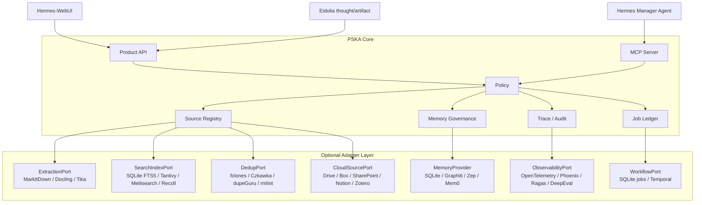

# PSKA Agentic System Upgrade Plan

更新时间：2026-08-13

## 1. Purpose

本文回答一个工程问题：

> 现有 PSKA-Essential 项目要做哪些改动和架构升级，才能实现
> `PSKA_AGENTIC_SYSTEM_TECHNICAL_PROPOSAL.zh.md` 中定义的个人外部认知智能体系统？

结论先行：

```text
现有项目已经有正确的控制面骨架。
下一阶段不应推翻它，而应把成熟组件接成 optional adapters。
PSKA 自己只继续拥有 SourceRef、Memory Card envelope、Review、Policy、Audit、Trace。
解析、查重、搜索增强、调度、可观测性、云端连接尽量使用成熟开源组件或现有插件。
```

## 2. Current-State Evidence

当前仓库已经具备 M10 级别的 source-safe baseline：

| 能力 | 当前状态 | 证据 |
| --- | --- | --- |
| Product API / MCP | 已暴露 workflow、ask、review、memory、source、jarvis、jobs、diagnostics | `mcp_server.py` 当前可列出 60+ `pska_*` tools |
| Source Registry | 已支持 local folder / Obsidian root、scan、FTS5 search、source read、neighbors | `source_registry.py` |
| File governance | 已有 exact hash duplicate report、source audit、saved search、tag/comment proposal/apply | `tests/test_source_registry.py` |
| Obsidian | 已有 MOC propose/apply，只写 PSKA marker block | `pska_obsidian_moc_propose/apply` |
| Jobs | 已有 source audit jobs、due tick、recurring cadence | `source_audit_jobs.py` |
| Memory | 已有 conversation-native memory change、review/apply/update/delete、superseded search view | `workflow.py`、`capabilities.py` |
| WebUI | 已有 Jarvis Bar、Sources panel、Review、Activity、diagnostics | `src/pska_essential/web/*` |
| Dependency strategy | 主包 `dependencies = []`，外部能力都必须显式配置 | `pyproject.toml` |

本机依赖盘点显示，MarkItDown、Docling、watchdog、OpenTelemetry、Graphiti 等成熟组件当前
都没有安装在默认环境中。因此升级必须采用 optional extras 和 adapter loading，不能把
第三方组件变成核心启动前提。

2026-08-13 更新：P1 的第一批 optional adapter 已接入代码路径。MarkItDown 和 fclones
仍不属于默认依赖；PSKA 现在会通过 capabilities/diagnostics 报告它们是 `available` 还是
`unavailable`，并在缺失时保持 core 功能可用。资料源抽取也已经有 PSKA-owned job
ledger、Product API、MCP tool、workspace next action 和 WebUI 入口；任务运行时只写
可重建的 source index metadata/FTS sections，不改用户源文件，不直写 memory，不要求
embedding。

## 3. Target Requirements

从技术方案推导，未来系统需要补齐这些能力：

1. 多格式 source extraction：PDF、DOCX、PPTX、XLSX、HTML、图片 OCR、附件。
2. 更强 no-embedding retrieval：FTS5 baseline 之外，可替换 Tantivy/Meilisearch/Recoll。
3. 安全查重：exact hash 之外支持近似重复、同名版本、相似文本、图片/音频候选。
4. Memory Card 产品化：active/suggestions/conflicts/stale/why-used 五个视图。
5. Memory use trace：记录记忆何时、为何影响 Hermes 行为。
6. Thought/Artifact bridge：Eidolia thought/artifact 能被 PSKA 引用、审计、提炼为 memory。
7. Specialist worker 架构：Researcher/Critic/Archivist/Memory Curator 等作为 Hermes 调用的
   tool bundles 或 future workers。
8. Durable jobs/wakeup：source audit、digest、extraction、dedup 可持续运行和恢复。
9. Observability/eval：跨 API/MCP/tool/source/memory 的 trace、metrics、eval。
10. Cloud connectors：Drive、Box、SharePoint、Notion、Zotero 等成为 source roots。

## 4. Upgrade Principle

PSKA 的升级策略应是：

```text
Core stays small.
Adapters become richer.
Providers stay replaceable.
Writes stay governed.
Heavy components stay optional.
```

具体原则：

- 保留 stdlib-first core；第三方依赖只进入 optional extras 或外部 CLI adapter。
- 所有成熟组件输出必须先归一化成 PSKA contracts，再进入 Product API/MCP/WebUI。
- 外部组件不能绕过 `SourceRef`、permission mode、Review、Audit。
- 所有文件写回和 durable memory 写入继续走 proposal/apply/review/policy。
- 使用成熟组件解决“脏活累活”，例如解析、OCR、查重、长期 workflow、observability。
- 不让成熟组件定义 PSKA 的认知语义。Memory Card、Trace、Thought/Artifact 投影由 PSKA
  自己拥有。

## 5. Target Architecture Delta

当前架构可升级为下面的 adapter-first 形态：



## 6. Build Vs Buy Matrix

| 能力 | 当前状态 | 优先成熟组件 | PSKA 需要自建的部分 | 建议 |
| --- | --- | --- | --- | --- |
| Markdown/txt/code extraction | 已有轻量内置 | 保留 | path/hash/heading/line SourceRef | 保留核心 |
| Office/PDF conversion | 不完整 | MarkItDown、Docling、Apache Tika | `ExtractionPort`、parse status、section coords | Phase 1 接 MarkItDown，Docling 做高级 PDF |
| OCR | 未做 | Docling OCR、OCRmyPDF、Tika OCR pipeline | OCR job 状态、失败暴露、SourceRef page coords | Phase 2 |
| Local lexical search | SQLite FTS5 | SQLite FTS5 | ranking envelope、scope、filters | 继续作为默认 |
| Strong local search | 未做 | Tantivy、Meilisearch、Recoll/Xapian | `SearchIndexPort`、adapter selection | Phase 3 评估 |
| Exact duplicate | 已做 | SQLite hash | duplicate report contract | 保留 |
| Approx duplicate | 未做 | fclones、Czkawka、dupeGuru、rmlint | `DedupPort`、dry-run proposal、destructive review | Phase 1/2 接 fclones dry-run |
| Obsidian MOC | 已做 marker block | Obsidian Local REST API、Omnisearch 参考 | vault SourceRef、permission、MOC apply | 保留本地文件写回；REST API 可选 |
| Source tags/comments | sidecar 已做 | TagSpaces 体验参考 | sidecar/native write policy | Phase 2 做 native write |
| Memory baseline | SQLite 已做 | SQLite | Memory Card envelope、review、lifecycle | Phase 1 产品化 |
| Temporal graph memory | Graphiti optional adapter | Graphiti / Zep | provenance envelope、supersession view | Phase 4，不进主路径 |
| Agent memory SaaS | 未接 | Zep、Mem0、Letta | provider-neutral search/apply/update/delete | Phase 5 适配器研究 |
| Workflow durability | SQLite jobs 已做 | Temporal | job metadata、policy、audit | Phase 4，看长任务规模再接 |
| MCP/cloud connectors | PSKA MCP 已有 | OpenAI MCP connectors、remote MCP servers | source root permission、SourceRef mapping | Phase 5 |
| Observability | SQLite audit | OpenTelemetry、Phoenix | PSKA trace schema、eval contracts | Phase 2/3 |
| RAG evaluation | smoke/product eval 已有 | Ragas、DeepEval | source/memory/use eval cases | Phase 3 |
| Agent framework | Hermes-first 已定 | LangGraph/Haystack/LlamaIndex 作为参考 | Hermes tool policy、skills、manager contract | 暂不替换 Hermes |

## 7. Required Project Changes

### 7.1 Adapter Contracts

`docs/ADAPTER_CONTRACTS.md` 应新增这些接口，不必一次实现所有 backend：

```python
class ExtractionPort:
    def extract(source_object, options) -> ExtractionResult: ...

class SearchIndexPort:
    def index(source_object, sections, options) -> IndexResult: ...
    def search(query, scope, filters, limit) -> list[ContextPacket]: ...

class DedupPort:
    def report(scope, mode, options) -> DuplicateReport: ...

class ObservabilityPort:
    def emit_trace(event) -> None: ...
    def emit_metric(metric) -> None: ...

class ThoughtArtifactPort:
    def read_context(refs, options) -> list[ThoughtArtifactContext]: ...
    def propose_memory(refs, intent) -> ReviewRecord: ...
```

注意：这些是 provider-facing interfaces。Product API/MCP 不应该暴露 MarkItDown、Docling、
fclones、Graphiti、Temporal 等 provider-native schema。

### 7.2 Optional Extras

`pyproject.toml` 建议保持默认 `dependencies = []`，新增 optional extras：

```toml
[project.optional-dependencies]
extract-markitdown = ["markitdown>=0.1.0,<1"]
extract-docling = ["docling>=2.0.0,<3"]
extract-tika = ["tika>=2.6.0,<3"]
watch = ["watchdog>=4.0.0,<7"]
observability = ["opentelemetry-api>=1.25.0,<2", "opentelemetry-sdk>=1.25.0,<2", "arize-phoenix>=8.0.0,<9"]
eval = ["ragas>=0.2,<1", "deepeval>=1,<2"]
memory-zep = ["zep-cloud>=3,<4"]
memory-mem0 = ["mem0ai>=0.1,<1"]
workflow-temporal = ["temporalio>=1.6.0,<2"]
```

CLI tools such as `fclones`、`rmlint`、`czkawka_cli` should not be Python
dependencies. They should be discovered at runtime and reported through
diagnostics.

### 7.3 Source Registry Schema

现有 `source_roots/source_objects/source_sections/source_fts/source_links` 可以保留。
建议新增或扩展：

```text
source_extract_jobs
  job_id, root_id, object_id, extractor, status, error, options_json,
  created_at, started_at, completed_at

source_extractions
  extraction_id, object_id, extractor, extractor_version, content_hash,
  text_hash, structure_json, warnings_json, created_at

source_collections
  collection_id, label, scope_json, query_json, created_at

source_duplicates_external
  report_id, adapter, mode, raw_output_path, normalized_json, created_at
```

`source_objects` 建议补字段：

```text
parse_status: unparsed | parsed | partial | failed | skipped
parse_error
extractor
extractor_version
last_extracted_at
```

### 7.4 Memory Schema And APIs

当前 `MemoryPatch.metadata` 已承载 `memory_type`、`behavior_delta`、`memory_scope`。
下一步应把 Memory Card 产品化为显式视图，而不是更换 memory provider：

2026-08-13 更新：P2 的第一块已落地为 Memory Card inventory/envelope view。
`GET /api/memory/cards`、`GET /api/memory/cards/{memory_id}`、
`pska_memory_card_list`、`pska_memory_card_get` 和 WebUI “记忆”面板已经可用。
Fake/SQLite memory provider 支持 full card inventory；Graphiti 当前只支持 search，
不支持 provider-neutral full enumeration。P2 的第二块已落地为 audit-backed
Memory use trace / why-used：`GET /api/memory/use-traces`、
`GET /api/memory/{memory_id}/use-trace`、`GET /api/memory/{memory_id}/why-used`、
`pska_memory_use_trace` 和 `pska_memory_why_used` 可解释某条记忆何时被
search 或 card inspection 作为候选上下文触达。P2 的第三块已落地为
Memory health scan：`GET /api/memory/health` 与 `pska_memory_health_scan`
扫描 low-quality、stale/refresh 和 conservative active-card conflicts，并进入
workspace/Jarvis next actions。最终回答级 used_memory_ids 仍是后续 P2。

新增 Product API / MCP：

```text
GET  /api/memory/cards
GET  /api/memory/cards/{memory_id}
GET  /api/memory/health
GET  /api/memory/use-traces
GET  /api/memory/{memory_id}/use-trace
GET  /api/memory/{memory_id}/why-used
GET  /api/memory/cards/suggestions
GET  /api/memory/cards/conflicts
GET  /api/memory/cards/stale
POST /api/memory/cards/{memory_id}/refresh-review

pska_memory_card_list
pska_memory_card_get
pska_memory_health_scan
pska_memory_use_trace
pska_memory_why_used
pska_memory_card_suggestions
pska_memory_card_conflicts
pska_memory_card_stale
pska_memory_refresh_review_create
```

SQLite memory provider 或 PSKA audit store 需要记录：

```text
memory_use_events
  event_id, memory_id, turn_id, run_id, action, behavior_delta,
  source_refs_json, answer_ref, created_at

memory_card_reviews
  memory_id, status, reason, refresh_rule, last_confirmed_at
```

这能实现技术方案里的 Active Cards、Suggestions、Conflicts、Stale Cards、Why Used。

### 7.5 Thought/Artifact Bridge

Eidolia 继续只暴露 `thought` / `artifact` 两种节点。PSKA 需要的不是新节点类型，而是引用
和 trace：

```text
SourceRef(adapter="eidolia", source_id=project_id, external_id=node_id, path=canvas_path)
Thought role metadata: belief | question | hypothesis | decision
Artifact kind metadata: brief | draft | diagram | report | code
Trace event: generated_from / cited_source / promoted_to_memory / superseded
```

新增接口：

```text
pska_eidolia_context_read
pska_eidolia_memory_review_create
pska_trace_query
```

实现上优先通过 Eidolia existing project files / sidecar JSON 读取，不把 Eidolia 数据复制成
PSKA canonical store。

### 7.6 Source Extraction Jobs

当前 `source_scan` 同步抽取文本，适合小文件。多格式解析需要 job 化：

```text
source_scan
  -> register object metadata
  -> enqueue extraction job when file type needs external parser
  -> source_extract_job_run
  -> write sections/fts/link metadata
  -> audit
```

新增工具：

```text
pska_source_extract_job_enqueue
pska_source_extract_job_list
pska_source_extract_job_run
```

第一版 adapter：

- `builtin_text`: 保留当前 Markdown/txt/code path。
- `markitdown`: broad file-to-markdown quick win。
- `docling`: PDF/table/layout/OCR-sensitive path。
- `tika`: fallback for very broad enterprise file types, likely as service/CLI.

### 7.7 Dedup Adapter

当前 exact hash 已够安全，但不够实用。建议新增 `DedupPort`：

```text
mode:
  exact_hash
  fclones_hash
  filename_fuzzy
  size_name_version
  text_similarity
  media_similarity
```

第一外部实现建议 `fclones`：

- 命令行成熟；
- 支持多 root；
- 可输出 JSON；
- PSKA 可先只读取报告，不执行删除。

备选：

- Czkawka：更适合 GUI/reference 和图片/媒体相似。
- dupeGuru：适合 filename/content fuzzy 体验参考。
- rmlint：适合高级 CLI 用户和 lint 报告。

PSKA 永远只公开 report/proposal，删除/移动/硬链接必须是后续 destructive review。

### 7.8 Search Strategy

不要急着替换 SQLite FTS5。升级顺序：

1. 继续优化 FTS5 schema、snippet、filters、saved searches。
2. 抽出 `SearchIndexPort`，让 source layer 不绑定 SQLite implementation。
3. 增加 Tantivy adapter 作为本地高性能全文索引候选。
4. Meilisearch 作为需要 typo tolerant、多用户 UI 和 server mode 时的候选。
5. Recoll/Xapian 作为桌面搜索 adapter 或 fallback。

embedding 仍作为 cache/enhancement，不进入本地 source 第一版前提。

### 7.9 Jobs And Wakeup

当前 SQLite job ledger 可以覆盖开发机和单用户场景。升级路线：

| 阶段 | 方案 |
| --- | --- |
| Now | SQLite job ledger + explicit tick |
| Near | `watchdog` 监听授权 root，生成 scan/extract/audit jobs |
| Mid | launchd/cron 调用 tick，不常驻也可用 |
| Later | Temporal 承载长时 digest、large extraction、multi-provider sync |

Temporal 不应进入 Phase 1，因为当前 jobs 还没有复杂到需要 durable execution platform。
等出现跨小时/跨天/跨服务的不可丢任务，再接 `WorkflowPort`。

### 7.10 Observability And Eval

当前 audit 是产品级账本，不是完整 observability。建议分层：

```text
Audit: 用户可理解的治理记录
Trace: 工程调试和跨组件链路
Eval: 定期验证 retrieval/memory/source/writeback 质量
```

优先新增：

- `pska_trace_id` 贯穿 Product API、MCP、workflow、source read、memory search。
- `memory.use` audit/action。
- source extraction failure metrics。
- duplicate proposal acceptance/rejection metrics。
- RAG/source recall eval cases。

成熟组件：

- OpenTelemetry：标准 trace/metrics/logs 输出。
- Phoenix：LLM/RAG tracing 和人工检查。
- Ragas/DeepEval：RAG 和 LLM workflow eval。

## 8. Upgrade Phases

### Phase 0: Freeze Contracts

目标：不改行为，先把升级边界写成 contract。

改动：

- 更新 `ADAPTER_CONTRACTS.md`，加入 `ExtractionPort`、`SearchIndexPort`、`DedupPort`、
  `ThoughtArtifactPort`、`ObservabilityPort`。
- 更新 `capabilities.py`，让 `/api/capabilities` 暴露 planned adapter slots。
- 文档测试固定这些 contract 名称。

验收：

- `tests.test_skill_docs` 通过。
- `pska_capabilities_get` 不声称未安装组件可用。

### Phase 1: Extraction And Dedup Quick Wins

目标：用成熟组件解决最多格式和近似查重，不破坏核心。

改动：

- 新增 `src/pska_essential/extraction.py` 和 `adapters/extraction/markitdown.py`。
- 新增 source extraction job routes/tools。
- 新增 `src/pska_essential/dedup.py` 和 `adapters/dedup/fclones.py`。
- `pska_duplicate_report(mode="fclones_hash")` 返回 dry-run normalized report。
- `component_check` 报告外部 CLI/Python optional package availability。

依赖：

- Python extra: `extract-markitdown`。
- CLI: `fclones` 通过 `command -v` 发现。

验收：

- 未安装 MarkItDown/fclones 时，diagnostics 明确 `unavailable`，核心测试仍过。
- 安装后，PDF/DOCX 能生成 text sections；fclones JSON 能归一化成 duplicate report。
- 任何 dedup action 都不删除文件。

### Phase 2: Memory Productization

目标：让记忆从“review/apply 功能”变成可管理资产。

改动：

- 新增 memory card views：active、suggestions、conflicts、stale、why-used。
- `memory_search` 和 Hermes source route 使用时记录 `memory.use`。
- WebUI 新增 Memory 管理面板，不只放 diagnostics probe。
- Jarvis briefing 纳入 stale/conflict memory next actions。

验收：

- 创建 source_route memory 后，下一次相关 retrieval 产生 memory use trace。
- WebUI 能展示某条记忆最近影响过哪些回答/动作。
- Superseded memory 默认不进入 active view。

### Phase 3: Source Governance Expansion

目标：提升 To C 文件夹/vault 管理能力。

改动：

- Obsidian frontmatter/tag/comment native write proposal/apply。
- MOC grouping：folder/tag/topic/project。
- Source collections：saved search 之外的可命名资料集合。
- Better search ranking：FTS5 snippet、filters、path/title weights。
- 评估 Tantivy/Meilisearch adapter，但不替换默认。

验收：

- `read_only` root native write 被拒绝。
- native write 只修改 preview 指定区域或 frontmatter fields。
- collection 可作为 retrieval scope。

### Phase 4: Thought/Artifact And Specialist Workers

目标：把 Eidolia 画布纳入 PSKA 的 Source/Thought/Artifact/Trace 模型。

改动：

- Eidolia node refs 转成 `SourceRef(adapter="eidolia")`。
- `pska_trace_query` 支持按 artifact/memory/source 找时间线。
- `pska_eidolia_memory_review_create` 从 thought 创建 Memory Card candidate。
- Hermes skill 增加 specialist consultation 规则。
- Specialist 先作为 tools/profile，不作为独立常驻 agent。

验收：

- Eidolia thought 可被引用为 memory source。
- Artifact 可追溯到 source refs 和 prompt/agentic trace。
- Specialist 输出不能绕过 PSKA policy。

### Phase 5: Observability, Eval, And Wakeup

目标：从“能跑”变成“可解释、可测试、可恢复”。

改动：

- OpenTelemetry optional tracing。
- Phoenix/Ragas/DeepEval eval adapters。
- `watchdog` 或 launchd/cron 调用 source scan/audit tick。
- Source extraction/digest/source audit job health dashboard。

验收：

- 每次 ask/source/memory/writeback 都有 trace id。
- Eval 可以覆盖 source recall、memory utility、why-used、writeback safety。
- 到期 audit 不需要用户手动点 tick，但仍只处理授权 root。

### Phase 6: Cloud Connectors And Optional Temporal Graph Memory

目标：扩展到云端资料源和更强 temporal memory。

改动：

- CloudSourcePort：Drive/Box/SharePoint/Notion/Zotero。
- 通过 OpenAI MCP connectors 或官方 APIs 接入，PSKA 统一成 source roots。
- Graphiti/Zep/Mem0/Letta adapter 评估。
- Temporal 只在 jobs 跨服务、长时间、必须恢复时引入。

验收：

- 云端 source 与本地 source 使用同一套 `SourceRef`、permission、audit。
- Graphiti/Zep 只接收 governed projections，不吞每个 chunk。
- Memory provider 替换不影响 Product API/MCP contract。

## 9. Concrete Backlog

### P0 Backlog

- [x] Add adapter slot definitions to `ADAPTER_CONTRACTS.md`.
- [x] Add planned slots to `source_layer_contract()` and `assistant_layer_contract()`.
- [x] Add tests that planned slots do not imply installed capability.

### P1 Backlog

- [x] Add `ExtractionPort` dataclasses: `ExtractionResult`, `ExtractedSection`, `ExtractionWarning`.
- [x] Add source extract job ledger and API/MCP routes.
- [x] Add builtin extractor wrapper around current Markdown/txt/code behavior.
- [x] Add MarkItDown adapter behind optional import.
- [x] Add `DedupPort` and fclones CLI adapter behind command discovery.
- [x] Extend `pska_duplicate_report` mode beyond `exact_hash`.

### P2 Backlog

- [x] Add explicit Memory Card list/search view.
- [x] Add memory use trace table or audit action.
- [x] Add WebUI Memory panel.
- [x] Add Jarvis memory conflict/stale next actions.

### P3 Backlog

- [ ] Obsidian frontmatter/tag native write proposal/apply.
- [ ] Source collections.
- [ ] FTS ranking improvements.
- [ ] Evaluate Tantivy adapter.

### P4 Backlog

- [ ] Eidolia `SourceRef` adapter.
- [ ] Thought/artifact trace import.
- [ ] Memory review creation from Eidolia thought.
- [ ] Specialist tool profiles.

## 10. What Not To Do Yet

- 不把 Graphiti/Zep/Mem0 设成必需依赖。
- 不把 Temporal 放进单用户第一主路径。
- 不用 Meilisearch/Tantivy 替换 SQLite FTS5，除非 FTS5 的规模或检索质量成为真实瓶颈。
- 不让 Hermes 直接调用 fclones 删除、移动、硬链接或清理文件。
- 不把 Obsidian 改造成 PSKA 数据库。
- 不把 Eidolia 加出一堆用户可见节点类型。
- 不从 batch digest 静默写 durable memory。
- 不让任何外部 connector 绕过 source root permission。

## 11. External References

本计划引用的成熟组件和标准，均作为 adapter/provider 候选，不作为 PSKA core 语义来源：

- [Microsoft MarkItDown](https://github.com/microsoft/markitdown)
- [Docling](https://docling.ai/) and [Docling GitHub](https://github.com/docling-project/docling)
- [Apache Tika](https://tika.apache.org/)
- [SQLite FTS5](https://www.sqlite.org/fts5.html)
- [RAGFlow](https://ragflow.io/) and [RAGFlow GitHub](https://github.com/infiniflow/ragflow)
- [fclones](https://github.com/pkolaczk/fclones)
- [Czkawka](https://github.com/qarmin/czkawka)
- [dupeGuru](https://dupeguru.voltaicideas.net/)
- [rmlint](https://rmlint.readthedocs.io/)
- [Graphiti](https://github.com/getzep/graphiti) and [Zep](https://www.getzep.com/)
- [Mem0](https://github.com/mem0ai/mem0)
- [Letta](https://docs.letta.com/v1-sdk/concepts/stateful-agents/)
- [Model Context Protocol architecture](https://modelcontextprotocol.io/specification/2025-06-18/architecture)
- [OpenAI MCP and connectors](https://developers.openai.com/api/docs/guides/tools-connectors-mcp)
- [Temporal durable execution](https://temporal.io/blog/what-is-durable-execution)
- [OpenTelemetry](https://opentelemetry.io/docs/)
- [LangGraph workflows and agents](https://docs.langchain.com/oss/python/langgraph/workflows-agents)
- [Haystack](https://haystack.deepset.ai/)
- [LlamaIndex](https://developers.llamaindex.ai/python/framework/)
- [Tantivy](https://github.com/quickwit-oss/tantivy)

## 12. Final Recommendation

近期最正确的工程路线不是“重写 PSKA”，而是：

```text
P0: 先冻结 adapter slots 和 capabilities。
P1: 接 MarkItDown + fclones，立刻提升资料源可用性和查重能力。
P2: 产品化 Memory Card 和 Why Used，让记忆真的可管理。
P3: 加强 Obsidian native write、source collections 和搜索质量。
P4: 接 Eidolia thought/artifact trace，把画布纳入认知连续性。
P5+: 视规模再引入 Temporal、Graphiti/Zep/Mem0、云端 connectors 和更重 observability。
```

这条路线保留 PSKA 当前最有价值的东西：它不是另一个重型平台，而是能把成熟组件组织成
一个安全、可追溯、会记忆、能创作的个人智能体系统的控制面。
