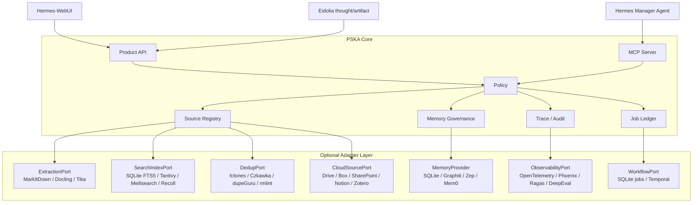

# PSKA Agentic System Upgrade Plan

更新时间：2026-08-13

## 1. Purpose

本文回答一个工程问题：

> 现有 PSKA-Essential 项目要做哪些改动和架构升级，才能实现
> `PSKA_AGENTIC_SYSTEM_TECHNICAL_PROPOSAL.zh.md` 中定义的个人外部认知智能体系统？

结论先行：

```text
现有项目已经有正确的控制面骨架。
下一阶段不应推翻它，而应把成熟组件接成 optional adapters。
PSKA 自己只继续拥有 SourceRef、Memory Card envelope、Review、Policy、Audit、Trace。
解析、查重、搜索增强、调度、可观测性、云端连接尽量使用成熟开源组件或现有插件。
```

## 2. Current-State Evidence

当前仓库已经具备 M21 级别的 source-safe baseline，并已推进到 M32 agentic context brief history：

| 能力 | 当前状态 | 证据 |
| --- | --- | --- |
| Product API / MCP | 已暴露 workflow、ask、review、memory、source、jarvis、agentic context brief/history、jobs、diagnostics、alpha readiness、alpha trial guide、alpha recovery plan、alpha first-run session | `mcp_server.py` 当前可列出 100+ `pska_*` tools |
| Source Registry | 已支持 local folder / Obsidian root、scan、FTS5 search、source read、neighbors | `source_registry.py` |
| Source Search | 已支持 SQLite FTS5 BM25、title/path/heading boost、highlighted snippet、LIKE fallback | `tests/test_source_registry.py` |
| File governance | 已有 exact hash、fclones/Czkawka hash、`size_name_version`、`text_similarity`、`media_metadata` 和 optional `image_phash` duplicate report、duplicate review list/mark、dry-run cleanup proposal、source audit、saved search、source collections、tag/comment proposal/apply | `tests/test_source_registry.py` |
| Obsidian | 已有 MOC propose/apply，只写 PSKA marker block，支持 folder/tag/topic/project 分组；tag apply 可显式写 frontmatter `tags`；comment apply 可显式追加 PSKA Comment block | `pska_obsidian_moc_propose/apply`, `pska_source_tag_propose/apply`, `pska_source_comment_propose/apply` |
| Jobs | 已有 source audit jobs、due tick、recurring cadence | `source_audit_jobs.py` |
| Memory | 已有 conversation-native memory change、review/apply/update/delete、superseded search view、Memory Card health/briefing/review queue、refresh-review 入口与专门 queue surface | `workflow.py`、`capabilities.py` |
| Hermes WebUI extension | 已有 `pska-mini` 薄入口：composer chip、scope 选择、turn context 注入、sidecar health/status、memory/review 小面板、Kanban/Tasks 投影 | `integrations/hermes-webui-extension/pska-mini/*` |
| 本地诊断页 | 已有 Jarvis Bar、Agentic Context Brief、Sources panel、Memory Card refresh-review、Review Queue 刷新复核计数与前后文本对照卡片、Activity、diagnostics；只用于 Product API smoke/debug，不是 v1 用户前端 | `src/pska_essential/web/*` |
| Dependency strategy | 主包 `dependencies = []`，外部能力都必须显式配置 | `pyproject.toml` |

本机依赖盘点显示，MarkItDown、Docling、watchdog、OpenTelemetry、Graphiti 等成熟组件当前
都没有安装在默认环境中。因此升级必须采用 optional extras 和 adapter loading，不能把
第三方组件变成核心启动前提。

2026-08-13 更新：P1 的第一批 optional adapter 已接入代码路径。MarkItDown、fclones 和 Czkawka
仍不属于默认依赖；PSKA 现在会通过 capabilities/diagnostics 报告它们是 `available` 还是
`unavailable`，并在缺失时保持 core 功能可用。fclones 可由 `PSKA_FCLONES_BIN`
显式指定可执行 binary，Czkawka 可由 `PSKA_CZKAWKA_BIN` 显式指定可执行 binary，
二者也可从 `PATH` 自动发现。资料源抽取也已经有 PSKA-owned job ledger、Product API、
MCP tool、workspace next action 和 WebUI 入口；任务运行时只写可重建的 source index
metadata/FTS sections，不改用户源文件，不直写 memory，不要求 embedding。

## 3. Target Requirements

从技术方案推导，未来系统需要补齐这些能力：

1. 多格式 source extraction：PDF、DOCX、PPTX、XLSX、HTML、图片 OCR、附件。
2. 更强 no-embedding retrieval：FTS5 baseline 之外，可替换 Tantivy/Meilisearch/Recoll。
3. 安全查重：exact hash 之外支持近似重复、同名版本、相似文本、图片/音频候选。
4. Memory Card 产品化：active/suggestions/conflicts/stale/why-used 五个视图。
5. Memory use trace：记录记忆何时、为何影响 Hermes 行为。
6. Thought/Artifact bridge：Eidolia thought/artifact 能被 PSKA 引用、审计、提炼为 memory。
7. Specialist worker 架构：Researcher/Critic/Archivist/Memory Curator 等作为 Hermes 调用的
   tool bundles 或 future workers。
8. Durable jobs/wakeup：source audit、digest、extraction、dedup 可持续运行和恢复。
9. Observability/eval：跨 API/MCP/tool/source/memory 的 trace、metrics、eval。
10. Cloud connectors：Drive、Box、SharePoint、Notion、Zotero 等成为 source roots。

## 4. Upgrade Principle

PSKA 的升级策略应是：

```text
Core stays small.
Adapters become richer.
Providers stay replaceable.
Writes stay governed.
Heavy components stay optional.
```

具体原则：

- 保留 stdlib-first core；第三方依赖只进入 optional extras 或外部 CLI adapter。
- 所有成熟组件输出必须先归一化成 PSKA contracts，再进入 Product API/MCP/WebUI。
- 外部组件不能绕过 `SourceRef`、permission mode、Review、Audit。
- 所有文件写回和 durable memory 写入继续走 proposal/apply/review/policy。
- 使用成熟组件解决“脏活累活”，例如解析、OCR、查重、长期 workflow、observability。
- 不让成熟组件定义 PSKA 的认知语义。Memory Card、Trace、Thought/Artifact 投影由 PSKA
  自己拥有。

## 5. Target Architecture Delta

当前架构可升级为下面的 adapter-first 形态：



## 6. Build Vs Buy Matrix

| 能力 | 当前状态 | 优先成熟组件 | PSKA 需要自建的部分 | 建议 |
| --- | --- | --- | --- | --- |
| Markdown/txt/code extraction | 已有轻量内置 | 保留 | path/hash/heading/line SourceRef | 保留核心 |
| Office/PDF conversion | 不完整 | MarkItDown、Docling、Apache Tika | `ExtractionPort`、parse status、section coords | Phase 1 接 MarkItDown，Docling 做高级 PDF |
| OCR | 未做 | Docling OCR、OCRmyPDF、Tika OCR pipeline | OCR job 状态、失败暴露、SourceRef page coords | Phase 2 |
| Local lexical search | SQLite FTS5 | SQLite FTS5 | ranking envelope、scope、filters | 继续作为默认 |
| Strong local search | 已评估候选 | Tantivy、Meilisearch、Recoll/Xapian | `SearchIndexPort`、adapter selection | 保持 SQLite FTS5 默认，待规模/质量瓶颈再接 |
| Exact duplicate | 已做 | SQLite hash | duplicate report contract | 保留 |
| Approx duplicate | 未做 | fclones、Czkawka、dupeGuru、rmlint | `DedupPort`、dry-run proposal、destructive review | Phase 1/2 接 fclones dry-run |
| Obsidian MOC | 已做 marker block | Obsidian Local REST API、Omnisearch 参考 | vault SourceRef、permission、MOC apply | 保留本地文件写回；REST API 可选 |
| Source tags/comments | sidecar 已做；Obsidian frontmatter tag 与 markdown comment native write 已做 | TagSpaces 体验参考 | sidecar/native write policy | 后续做更丰富 frontmatter fields |
| Memory baseline | SQLite 已做 | SQLite | Memory Card envelope、review、lifecycle | Phase 1 产品化 |
| Temporal graph memory | Graphiti optional adapter | Graphiti / Zep | provenance envelope、supersession view | Phase 4，不进主路径 |
| Agent memory SaaS | 未接 | Zep、Mem0、Letta | provider-neutral search/apply/update/delete | Phase 5 适配器研究 |
| Workflow durability | SQLite jobs 已做 | Temporal | job metadata、policy、audit | Phase 4，看长任务规模再接 |
| MCP/cloud connectors | PSKA MCP 已有 | OpenAI MCP connectors、remote MCP servers | source root permission、SourceRef mapping | Phase 5 |
| Observability | SQLite audit | OpenTelemetry、Phoenix | PSKA trace schema、eval contracts | Phase 2/3 |
| RAG evaluation | smoke/product eval 已有 | Ragas、DeepEval | source/memory/use eval cases | Phase 3 |
| Agent framework | Hermes-first 已定 | LangGraph/Haystack/LlamaIndex 作为参考 | Hermes tool policy、skills、manager contract | 暂不替换 Hermes |

## 7. Required Project Changes

### 7.1 Adapter Contracts

`docs/ADAPTER_CONTRACTS.md` 应新增这些接口，不必一次实现所有 backend：

```python
class ExtractionPort:
    def extract(source_object, options) -> ExtractionResult: ...

class SearchIndexPort:
    def index(source_object, sections, options) -> IndexResult: ...
    def search(query, scope, filters, limit) -> list[ContextPacket]: ...

class DedupPort:
    def report(scope, mode, options) -> DuplicateReport: ...

class ObservabilityPort:
    def emit_trace(event) -> None: ...
    def emit_metric(metric) -> None: ...

class ThoughtArtifactPort:
    def read_context(refs, options) -> list[ThoughtArtifactContext]: ...
    def propose_memory(refs, intent) -> ReviewRecord: ...
```

注意：这些是 provider-facing interfaces。Product API/MCP 不应该暴露 MarkItDown、Docling、
fclones、Graphiti、Temporal 等 provider-native schema。

### 7.2 Optional Extras

`pyproject.toml` 建议保持默认 `dependencies = []`，新增 optional extras：

```toml
[project.optional-dependencies]
extract-markitdown = ["markitdown>=0.1.0,<1"]
extract-docling = ["docling>=2.0.0,<3"]
extract-tika = ["tika>=2.6.0,<3"]
image-phash = ["ImageHash>=4.3,<5"]
watch = ["watchdog>=4.0.0,<7"]
observability = ["opentelemetry-api>=1.25.0,<2", "opentelemetry-sdk>=1.25.0,<2", "arize-phoenix>=8.0.0,<9"]
eval = ["ragas>=0.2,<1", "deepeval>=1,<2"]
memory-zep = ["zep-cloud>=3,<4"]
memory-mem0 = ["mem0ai>=0.1,<1"]
workflow-temporal = ["temporalio>=1.6.0,<2"]
```

CLI tools such as `fclones`、`rmlint`、`czkawka_cli` should not be Python
dependencies. They should be discovered at runtime and reported through
diagnostics.

### 7.3 Source Registry Schema

现有 `source_roots/source_objects/source_sections/source_fts/source_links` 可以保留。
建议新增或扩展：

```text
source_extract_jobs
  job_id, root_id, object_id, extractor, status, error, options_json,
  created_at, started_at, completed_at

source_extractions
  extraction_id, object_id, extractor, extractor_version, content_hash,
  text_hash, structure_json, warnings_json, created_at

source_collections
  collection_id, label, scope_json, query_json, created_at

source_duplicates_external
  report_id, adapter, mode, raw_output_path, normalized_json, created_at
```

`source_objects` 建议补字段：

```text
parse_status: unparsed | parsed | partial | failed | skipped
parse_error
extractor
extractor_version
last_extracted_at
```

### 7.4 Memory Schema And APIs

当前 `MemoryPatch.metadata` 已承载 `memory_type`、`behavior_delta`、`memory_scope`。
下一步应把 Memory Card 产品化为显式视图，而不是更换 memory provider：

2026-08-13 更新：P2 的第一块已落地为 Memory Card inventory/envelope view。
`GET /api/memory/cards`、`GET /api/memory/cards/{memory_id}`、
`pska_memory_card_list`、`pska_memory_card_get` 和 WebUI “记忆”面板已经可用。
Fake/SQLite memory provider 支持 full card inventory；Graphiti 当前只支持 search，
不支持 provider-neutral full enumeration。P2 的第二块已落地为 audit-backed
Memory use trace / why-used：`GET /api/memory/use-traces`、
`GET /api/memory/{memory_id}/use-trace`、`GET /api/memory/{memory_id}/why-used`、
`pska_memory_use_trace` 和 `pska_memory_why_used` 可解释某条记忆何时被
search 或 card inspection 作为候选上下文触达。P2 的第三块已落地为
Memory health scan：`GET /api/memory/health` 与 `pska_memory_health_scan`
扫描 low-quality、stale/refresh 和 conservative active-card conflicts，并进入
workspace/Jarvis next actions。P2 的第四块已落地为 answer-level memory
attribution：Ask/workflow artifact、export JSON、WebUI Ask/Writing、
`GET /api/workflows/{run_id}/memory-attribution` 和
`pska_workflow_memory_attribution` 均暴露 `used_memory_ids`；同时新增
`memory_suggestions`、`GET /api/workflows/{run_id}/memory-suggestions` 与
`pska_workflow_memory_suggestions`，只提供 Review 候选，不直接写 Memory。
P2 的第五块已落地为 Memory Timeline / Ledger view：
`GET /api/memory/{memory_id}/timeline` 与 `pska_memory_timeline` 将 Memory Card
snapshot、lifecycle change audit、candidate-use trace 和 SourceRef anchor 合并为
一条 provider-neutral 时间线。它是派生视图，不创建第二套 memory store，也不冒充
隐藏模型因果。P2 的第六块已落地为 Memory Briefing：
`GET /api/memory/briefing` 与 `pska_memory_briefing` 将 active cards、health
issues、recent use traces 和 timeline/why-used next actions 合并为 Hermes/Jarvis
可读的记忆注意力摘要；WebUI “记忆”面板新增“记忆简报”。它仍然是派生视图，
不直接写 durable memory。P2 的第七块已落地为 Memory Review Queue：
`GET /api/memory/review-queue` 与 `pska_memory_review_queue` 将 pending/accepted
Review records、Memory Briefing focus items 和 health issues 分组成只读维护队列；
WebUI “异常审核”面板新增“记忆维护队列”。它只帮助 triage，不 approve/apply/write
memory。P2 的第八块已落地为 source audit -> memory candidate：
`POST /api/sources/memory-candidates/from-audit` 与
`pska_source_memory_candidates_from_audit` 将 folder/vault audit 发现的 route-like
entry points 批量转换为 governed Memory Card review candidates。它使用 SourceRef、
memory_type、memory_scope、behavior_delta 做确定性去重，跳过已有
pending/accepted/needs_edit review；它不写源文件、不直接写 memory、不需要
embedding。P2 的第九块已落地为 embedding-free candidate dedup：
`GET /api/memory/candidate-dedup` 与 `pska_memory_candidate_dedup` 对 Review
里的 durable memory candidates 做重复候选提示。它使用 normalized text、token
overlap、SourceRef fingerprint、behavior_delta fingerprint 聚类，并将
`duplicate_candidates` 接入 Memory Review Queue；它不合并、不拒绝、不审批、不 apply、
不写 durable memory。P2 的第九块后续已扩展 `related_groups`，用于提示跨
`memory_scope` 的相关候选/作用域冲突，例如同一偏好同时被提成 global 与 project memory；
Memory Review Queue 对应新增 `related_candidates` group。P2 的第十块已落地为 conversation -> Memory Card candidate：
`POST /api/memory/conversation-candidates` 与
`pska_conversation_memory_candidates_create` 接收 Hermes 从对话中提炼出的结构化候选，
要求 `text`、`memory_type`、`memory_scope`、`behavior_delta` 和消息证据，创建
pending Review items，并按 `memory_type/memory_scope/behavior_delta/text` 去重；它不直接
写 memory provider，也不把普通聊天摘要当作记忆。P2 的第十一块已落地为
conversation candidate review queue surface：Memory Review Queue 新增
`conversation_candidates` group、`conversation_candidate_count` summary 和
`review_conversation_memory_candidate` next action；Jarvis briefing 会把这类候选作为明确的
memory priority，而不是淹没在普通 pending reviews 中。P2 的第十二块已落地为
conversation candidate revision ergonomics：`needs_edit` 的 memory_patch Review
可以通过 WebUI、`POST /api/reviews/{review_id}/revision` 和 `pska_review_revise`
提交修订后的 `memory_candidate` 字段，重写候选文本、memory_type、memory_scope 与
behavior_delta，同时保留原始证据 refs 与 revision lineage。P2 的第十三块已落地为
group-level review decisions：Memory Review Queue 会给 conversation candidates 和
pending reviews 暴露 batch accept/reject，底层入口是
`POST /api/reviews/batch-decision` 与 `pska_review_decide_batch`；批量决策不写
durable memory，只把候选推进到 accepted/rejected Review 状态，后续仍需显式 apply。P2
的第十四块已落地为 explicit candidate merge primitive：`POST /api/reviews/merge-candidates`
与 `pska_review_merge_candidates` 接收 duplicate/related candidate review ids 和人工确认的
merged `memory_candidate` 字段，创建新的 pending Review，合并 source refs，并将仍 pending 的
旧候选标为 needs_edit；它不自动 approve/apply/write memory。P2 的第十五块已落地为
lightweight merge editor：WebUI 在 duplicate/related candidate queue group 内显示合并编辑器，
展示成员候选的文本/behavior_delta/type/scope/status，并允许填写合并后的候选文本和
behavior_delta 后创建 merged Review。P2 的第十六块已落地为 merge lineage in Review
records：merged Review 会暴露 `merged_from_review_ids`，被替换旧 Review 会暴露
`merged_into_review_id`，WebUI Review card 会显示 merge tags。P2 的第十七块已落地为
merged replacement triage hygiene：Memory Review Queue 将被 merge 替换的旧候选分到
低优先级 `merged_replacements` 谱系组，并从 active duplicate/related candidate dedup 中排除；
它们仍可追溯到 merged Review，但不再制造假的 `needs_edit` 待办。P2 的第十八块已落地为
candidate quality gate：Memory Review Queue 对 pending/accepted 但未 apply 的 memory_patch
Review 检查 Memory Card envelope、source evidence 和 behavior impact；缺 `memory_type`、
`memory_scope`、`behavior_delta` 或文本/行为变化过泛时，会进入 `candidate_quality` group，
提示先 review/edit，而不是把空泛候选推进 durable memory。P2 的第十九块已落地为
apply-time candidate quality enforcement：`pska_memory_apply` 对 memory_patch 写入复用同一
质量门，conversation/workflow-derived memory proposal 会先补 conservative Memory Card
envelope；裸的低质量 memory_patch 即使绕过 queue/Review UI 被 accept，也不能写入 durable
memory provider。P2 的第二十块已落地为 workspace status quality routing：`pska_workspace_status`
对 accepted_unapplied memory reviews 复用 candidate quality filter；低质量 accepted
memory_patch 不再产生 `apply_accepted_memory` next action，而是产生
`review_memory_candidate_quality`，避免 Hermes/Jarvis 撞上必然失败的 apply gate。P2 的第二十一块
已落地为 WebUI quality-fix workbench seed：Memory Review Queue 的 `candidate_quality`
item 带 `text`、`missing_fields`、Memory Card type/scope 和 behavior_delta；WebUI 在队列内
提供内联修订控件，先将未 apply 候选标为 `needs_edit`，再提交新的 revised Review，仍保持
Review/apply 治理边界。P2 的第二十二块已落地为 revised replacement queue hygiene：
普通 revision 生成 successor Review 后，旧 `needs_edit` 不再留在主动 `needs_edit`
group，而进入低优先级 `revised_replacements`，并通过 `open_revised_review` 指向新 Review。
P2 的第二十三块已落地为 candidate quality breakdown：Memory Review Queue summary 按
issue type、missing field、status、severity 聚合质量问题，并提供 top issue/missing field；
Jarvis 和 WebUI summary 会用这个信号提示优先修复方向。P2 的第二十四块已落地为
candidate quality batch edit action：`candidate_quality` group 暴露
`mark_quality_group_needs_edit`，通过 `pska_review_decide_batch` 将整组问题候选转入
`needs_edit`，但不写 memory、不自动创建 revised Review。P2 的第二十五块已落地为
needs-edit inline revision workbench：active `needs_edit` memory_patch queue item 暴露结构化
`memory_candidate` draft 与 inline revision capability，WebUI 可在队列内继续编辑并提交 revised
Review，把批量质量返修流程补成闭环。
P2 的第二十六块已落地为 Memory Card refresh-review seed：
`POST /api/memory/cards/{memory_id}/refresh-review` 与
`pska_memory_refresh_review` 从现有 durable Memory Card 创建 pending `memory_update` Review，
记录 refresh reason、previous/proposed text 与 no-text-change refresh request；它强制人工复核，
不直接写 durable memory，后续仍需 `review_decide(accept)` 和 `memory_apply`。
P2 的第二十七块已落地为 refresh-review queue surfacing：
Memory Review Queue 将这类 existing-card refresh/update Review 单独放入
`refresh_reviews` group，summary 暴露 `refresh_review_count`，next action 使用
`review_memory_refresh` 指向 `pska_review_get`；Jarvis briefing 和 WebUI summary 使用同一
信号优先提醒记忆卡维护，仍然不 approve/apply/write durable memory。
P2 的第二十八块已落地为 WebUI refresh-review workbench：
WebUI Memory Review Queue 对 `memory_refresh_review` item 使用专门卡片展示
source memory id、previous text、proposed text、no-text-change refresh check 和
打开 Review 的动作，让人工复核能直接比较旧记忆与刷新提案；它仍然只是 UI 工作台，
不新增写入路径。
P2 的第二十九块已落地为 alpha readiness gate：
`GET /api/alpha/readiness` 与 `pska_alpha_readiness` 只读聚合 runtime diagnostics、
workspace status、source safety、memory governance、KB readiness、memory health 与 UX 缺口，
输出 `alpha_ready` / `technical_alpha` / `not_ready` 级别、required failures 和 next actions；
它不运行 closed-loop probe、不写 source、不写 durable memory。
P2 的第三十块已落地为 alpha trial guide：
`GET /api/alpha/trial-guide` 与 `pska_alpha_trial_guide` 会把 readiness verdict 转译成
只读优先的首次试用路线：runtime/provider/workspace 配置、一组小范围 knowledge scope、
sourced Ask、Memory Review、写回前备份检查，以及 broader-alpha exit criteria。
它返回 phases、guardrails、first-run scope、next actions 和 exit criteria，但不会自动注册 root、
扫描文件、apply durable memory 或写 source files。
P2 的第三十一块已落地为 WebUI alpha trial guide surface：
Home 会加载 `/api/alpha/trial-guide`，展示 trial mode、check/warn/fail 计数、phase cards、
guardrails 与 next-action buttons。按钮只导航到 Settings、Sources、Ask 或 Review，并复用
PSKA action dispatch；不会从 Home 自动执行 source scan、source writeback 或 memory apply。
P2 的第三十二块已落地为 alpha recovery plan：
`GET /api/alpha/recovery-plan` 与 `pska_alpha_recovery_plan` 会只读列出 PSKA-owned
SQLite ledgers、user-owned source roots、provider-owned KB/memory state、restore drills、
writeback preflight 和 operator checklist。它不创建备份、不恢复数据、不导出 provider、
不写 source files，也不直接写 durable memory；WebUI Home 在 Alpha Trial Guide 内展示
备份对象和写回前置检查。
P2 的第三十三块已落地为 alpha first-run session：
`GET /api/alpha/first-run-session`、`POST /api/alpha/first-run-session/items/{item_id}`、
`pska_alpha_first_run_session` 与 `pska_alpha_first_run_item_update` 会把首次试用清单的
人工确认进度持久化到 PSKA local ledger，并记录 create/update audit events。它只写
checklist state，不执行清单条目背后的 runtime check、source scan、Ask、writeback、
backup、restore 或 durable memory apply；WebUI Home 可刷新清单、标记完成/撤回/跳过，
并把“打开”动作导航到对应 view。
P2 的第三十四块已落地为 alpha first-run notes：
WebUI 首次试用清单的每个 item 都可以记录人工确认依据、异常或复盘备注；保存备注复用
同一个 first-run item update 路由，只更新 PSKA checklist/audit state。这个备注是 alpha
rehearsal evidence，不会写回用户资料源，也不会自动变成 durable memory。
P2 的第三十五块已落地为 ChatGPT memory summary import：
`POST /api/memory/chatgpt-summary/import` 与 `pska_chatgpt_memory_summary_import`
把 ChatGPT 个性化记忆摘要文本或文件转换成 governed Memory Card Review candidates。
它复用 conversation candidate/review queue 通道，不直接写 GBrain/SQLite memory，
不写 source files，不需要 embedding，也不会把完整导入文本写入 audit；默认跳过
私密人生、家庭、健康和亲密经历段落，只创建一条隐私使用边界候选。
P2 的第三十六块已落地为 ChatGPT conversations source archive import：
`POST /api/sources/chatgpt-conversations/import` 与
`pska_chatgpt_conversations_import` 把 `conversations.json`、ChatGPT 导出
zip 或包含该文件的文件夹规范化为 PSKA 管理的 markdown 资料档案，并注册为
read-only local source root。它不修改原始导出，不直接写 GBrain/SQLite memory，
不创建 Review，不需要 embedding；每个 archive 会生成 `PSKA_IMPORT_MANIFEST.json`
和 `PSKA_IMPORT_REPORT.md` 作为可持久回查的导入证据；重复导入同一 archive
目录时会先清理带 PSKA 标记的旧导入产物，避免旧会话被 source scan 误索引，同时保留无标记用户文件；
后续只能先 source search/read，再把被确认的稳定事实走 governed memory review。

P2 的第三十七块已落地为 WebUI Source Evidence workbench：
Hermes WebUI `pska-mini` 的 PSKA Memory 页面可以在当前选中的 source roots 内搜索原始证据，
通过 `/api/sources/read` 读取全文，再把证据起草为带 `SourceRef` 的 Memory Review candidate。
草稿保留“需要人工改写”的前缀，未改写前不会进入 Review Queue；这使 ChatGPT 完整对话导入后的筛选、
证据定位、候选记忆创建形成一条可 dogfooding 的闭环。

P2 的第三十八块已落地为 first-run Source Evidence rehearsal：
alpha first-run checklist 新增 `rehearse_source_evidence_memory` 必选项，要求操作者在首次试用中练一次
source search/read -> source-backed memory draft -> human rewrite -> Review Queue 的路径。这个 item
只写 checklist/audit state，不执行 search/read，不创建 Review，不写 source files，也不直接写 durable memory；
Hermes WebUI 只有在 Source Evidence draft 已附加来源后才显示 `Mark rehearsal done`，点击后把来源写入
operator note；旧内置页面展示上限同步放宽，避免第 8 个清单项被隐藏。

P2 的第三十九块已落地为 first-run sourced Ask proof：
Hermes WebUI 在 Recent Answer Proofs 中打开一条只读、检查通过、且实际使用了 PSKA 工具的 proof 后，
显示 `Mark sourced Ask done`。点击后把 `run_sourced_ask` 标成 done，并把 proof id、工具摘要和
scope 计数写入 operator note。这个动作只写 checklist/audit state，不重新执行 Ask，不创建 Review，
也不写 durable memory。

P2 的第四十块已落地为 first-run Review Queue inspection：
Hermes WebUI 在 Review Queue 中打开一条 Review Detail 后，显示 `Mark review inspected`。
点击后把 `review_memory_queue` 标成 done，并把 review id、候选类型、状态和 source-ref 数量写入
operator note。这个动作只记录检查证据，不 accept/reject/apply，也不写 durable memory。

P2 的第四十一块已落地为 first-run selected scope proof：
Hermes WebUI 只在浏览器当前已显式选择 dataset、document 或 source root scope 时，在 Memory 页状态区显示
`Mark scope selected`。点击后把 `select_read_only_scope` 标成 done，并把 scope 数量和短 id 写入
operator note。这个动作不注册 source root，不 parse dataset，不扫描文件，也不改变 provider state。

P2 的第四十二块已落地为 first-run runtime/provider proof：
Hermes WebUI 在 PSKA API ready 时，于 Memory 页状态区显示 `Mark runtime confirmed`。
点击后把 `confirm_runtime` 标成 done，并把 API、memory、KB、embedding、GBrain 与 alpha 状态写入
operator note。这个动作只记录人工确认，不启动服务，不更换 provider，也不重新运行 diagnostics。

P2 的第四十三块已落地为 first-run recovery/writeback proof：
Hermes WebUI 读取 `GET /api/alpha/recovery-plan` 后，在 Memory 页状态区显示
`Mark recovery reviewed` 与 `Mark writeback locked`。前者把 `confirm_recovery_plan`
标成 done，并记录 backup items、restore drills、warnings 和 recovery data flow；后者把
`keep_writeback_locked` 标成 done，并记录 writeback preflight 与首次试用仍被锁定的 native
writeback 操作。两个动作都不创建备份、不恢复数据、不导出 provider，也不启用 source writeback。

P2 的第四十四块已落地为 first-run exit notes：
Hermes WebUI 在 first-run checklist header 显示 `Mark exit notes`。点击后把
`record_exit_notes` 标成 done，并记录 readiness、recovery、required item progress 和保守的
repeat guidance。这个动作不改变 alpha readiness，不把系统自动升级为 broader trial，只保存操作者
对本次首次演练的退出总结。

P4 的第一块 trace query 也已落地为跨对象派生视图：
`GET /api/trace/query` 与 `pska_trace_query` 可以按 review_id、proposal_id、
memory_id、target_type/target_id、action 或 SourceRef 查询 audit/review 轨迹。
它覆盖 Eidolia `SourceRef(adapter="eidolia")`、Memory Review records 和普通 audit
events；不新建第二套 trace store，不写源文件，不写 durable memory，不需要 embedding，
也不声称能还原隐藏模型因果。

P4 的回答侧 proof 也已落地为最小闭环：
`POST /api/hermes/answer-proofs` 接收 Hermes WebUI proof harness 或后续 extension bridge
捕获到的真实回答证据，写入 `hermes.answer_proof` audit；`GET /api/hermes/answer-proofs`
和 `GET /api/trace/query?action=hermes.answer_proof` 可反查本轮回答实际观测到哪些
PSKA 工具调用、是否只读、对应 dataset/source root 范围和检查结果。它只保存问题/回答的
短预览、SHA-256、工具摘要和检查结果，不保存完整回答文本，不写长期记忆，不写用户源文件。
Hermes WebUI extension 已能从某条 proof 起草可编辑的 Memory Review 候选，并把
`SourceRef(adapter="hermes_answer_proof")` 附到候选上；未改写的 proof 草稿不会直接提交。

P5 的第一块 trace coverage 已落地：
`GET /api/observability/trace-coverage` 与 `pska_trace_coverage` 从 SQLite audit
只读生成覆盖报告，按 ask、source/retrieval、memory、governed writeback、eval
和 background jobs 分组检查最近操作是否有可恢复的 PSKA trace id。它不新建
trace store，不导出外部 trace，不写源文件，不写 durable memory；OpenTelemetry
和 Phoenix 仍作为后续可选 exporter。

P5 的 job health dashboard baseline 已落地：
`GET /api/jobs/health` 与 `pska_job_health` 在 `pska_provider_jobs` 的归一化队列
之上生成只读健康视图，按 digest、source audit、source extraction 和可选 KB
ingestion 分组显示 due、queued、failed、stale、actionable 计数和下一步动作。
它不会在读取时运行 job，不会自动 tick due schedule，不写源文件、source registry
或 Memory；自动 tick 仍交给 launchd/cron 调用显式 endpoint。

P5 的 local wakeup plan baseline 已落地：
`GET /api/wakeup/plan` 与 `pska_wakeup_plan` 会只读检查 scheduled source audit
jobs、due 数量、本机 launchd plist 是否存在/匹配，并生成 launchd plist preview、
cron fallback line 与人工安装命令。读取 plan 不会安装 scheduler，不会调用 tick，
不会运行 job，不扫描 source root，不写 Memory；显式 CLI `pska-essential-wakeup install`
才会写 `~/Library/LaunchAgents`。

P5 的 observability metrics baseline 已落地：
`GET /api/observability/metrics` 与 `pska_observability_metrics` 会从 SQLite audit
只读聚合 source extraction、source recall、duplicate review、eval、Hermes
answer proof、memory use 和 memory governance 指标。它用于回答“最近哪里失败、
哪里零召回、哪些重复组待复核、回答证据是否有失败检查”，不会运行 job、不会
activate due schedule、不会创建 Review、不会写 source/memory，也不会导出外部 trace。

新增 Product API / MCP：

```text
POST /api/sources/memory-candidates/from-audit
POST /api/sources/chatgpt-conversations/import
POST /api/memory/conversation-candidates
POST /api/memory/chatgpt-summary/import
GET  /api/memory/cards
GET  /api/memory/cards/{memory_id}
GET  /api/memory/briefing
GET  /api/memory/review-queue
GET  /api/memory/candidate-dedup
GET  /api/memory/health
GET  /api/memory/use-traces
GET  /api/memory/{memory_id}/use-trace
GET  /api/memory/{memory_id}/why-used
GET  /api/memory/{memory_id}/timeline
GET  /api/trace/query
GET  /api/wakeup/plan
GET  /api/observability/metrics
GET  /api/sources/recall-eval
POST /api/sources/recall-eval
POST /api/hermes/answer-proofs
GET  /api/hermes/answer-proofs
POST /api/agentic/context-brief
GET  /api/memory/cards/suggestions
GET  /api/memory/cards/conflicts
GET  /api/memory/cards/stale
GET  /api/alpha/readiness
GET  /api/alpha/trial-guide
GET  /api/alpha/recovery-plan
GET  /api/alpha/first-run-session
POST /api/alpha/first-run-session/items/{item_id}
POST /api/memory/cards/{memory_id}/refresh-review

pska_memory_card_list
pska_memory_card_get
pska_alpha_readiness
pska_alpha_trial_guide
pska_alpha_recovery_plan
pska_alpha_first_run_session
pska_alpha_first_run_item_update
pska_memory_refresh_review
pska_memory_briefing
pska_memory_review_queue
pska_memory_candidate_dedup
pska_memory_health_scan
pska_memory_use_trace
pska_memory_why_used
pska_memory_timeline
pska_trace_query
pska_trace_coverage
pska_observability_metrics
pska_job_health
pska_wakeup_plan
pska_agentic_context_brief
pska_agentic_context_brief_list
pska_workflow_memory_attribution
pska_workflow_memory_suggestions
pska_memory_change_from_conversation
pska_conversation_memory_candidates_create
pska_chatgpt_memory_summary_import
pska_memory_review_from_workflow
pska_source_memory_candidates_from_audit
```

SQLite memory provider 或 PSKA audit store 需要记录：

```text
memory_use_events
  event_id, memory_id, turn_id, run_id, action, behavior_delta,
  source_refs_json, answer_ref, created_at

memory_card_reviews
  memory_id, status, reason, refresh_rule, last_confirmed_at
```

这能实现技术方案里的 Active Cards、Suggestions、Conflicts、Stale Cards、Why Used。

### 7.5 Thought/Artifact Bridge

Eidolia 继续只暴露 `thought` / `artifact` 两种节点。PSKA 需要的不是新节点类型，而是引用
和 trace：

```text
SourceRef(adapter="eidolia", source_id=project_id, external_id=node_id, path=canvas_path)
Thought role metadata: belief | question | hypothesis | decision
Artifact kind metadata: brief | draft | diagram | report | code
Trace event: generated_from / cited_source / promoted_to_memory / superseded
```

新增接口：

```text
pska_eidolia_context_read              # Done: payload -> SourceRef(adapter="eidolia")
pska_eidolia_memory_review_create      # Done: thought/artifact -> governed Memory Card review
pska_trace_query                       # Done: audit/review/source/memory/Eidolia derived trace
pska_trace_coverage                    # Done: recent audit coverage by PSKA category
pska_observability_metrics             # Done: source/recall/duplicate/eval/proof/memory metrics
pska_source_recall_eval                # Done: fixture/provided source recall case eval
pska_eidolia_project_trace_import      # Done: explicit project files -> SourceRef/audit trace
```

当前 v1 先提供 payload bridge：调用方传入 project/node/text/role/kind，PSKA 生成
Eidolia SourceRef、audit 和 Review candidate，不复制、不修改 Eidolia project files。
`pska_trace_query` 已可把 Eidolia context read、memory review create 和 Review record
串成只读轨迹；`pska_eidolia_project_trace_import` 已可只读读取显式传入的
Eidolia project folder、`canvas-workspace.json` 和 `agentic-traces/*.json`，把
thought/artifact/trace 规范成 SourceRef 和 audit 记录，但不把 Eidolia 数据复制成 PSKA
canonical store。

### 7.6 Source Extraction Jobs

当前 `source_scan` 同步抽取文本，适合小文件。多格式解析需要 job 化：

```text
source_scan
  -> register object metadata
  -> enqueue extraction job when file type needs external parser
  -> source_extract_job_run
  -> write sections/fts/link metadata
  -> audit
```

新增工具：

```text
pska_source_extract_job_enqueue
pska_source_extract_job_list
pska_source_extract_job_run
```

第一版 adapter：

- `builtin_text`: 保留当前 Markdown/txt/code path。
- `markitdown`: broad file-to-markdown quick win。
- `docling`: PDF/table/layout/OCR-sensitive path。
- `tika`: fallback for very broad enterprise file types, likely as service/CLI.

### 7.7 Dedup Adapter

当前 exact hash 已够安全，但不够实用。建议新增 `DedupPort`：

```text
mode:
  exact_hash
  size_name_version
  fclones_hash
  czkawka_hash
  filename_fuzzy
  text_similarity
  media_metadata
  image_phash
  media_similarity
```

第一外部实现建议 `fclones`：

- 命令行成熟；
- 支持多 root；
- 可输出 JSON；
- PSKA 可先只读取报告，不执行删除。

备选：

- Czkawka：更适合 GUI/reference 和图片/媒体相似。
- dupeGuru：适合 filename/content fuzzy 体验参考。
- rmlint：适合高级 CLI 用户和 lint 报告。

PSKA 永远只公开 report/proposal，删除/移动/硬链接必须是后续 destructive review。

### 7.8 Search Strategy

不要急着替换 SQLite FTS5。升级顺序：

1. 继续优化 FTS5 schema、snippet、filters、saved searches。
2. 抽出 `SearchIndexPort`，让 source layer 不绑定 SQLite implementation。
3. 增加 Tantivy adapter 作为本地高性能全文索引候选。
4. Meilisearch 作为需要 typo tolerant、多用户 UI 和 server mode 时的候选。
5. Recoll/Xapian 作为桌面搜索 adapter 或 fallback。

embedding 仍作为 cache/enhancement，不进入本地 source 第一版前提。

2026-08-21 P3-Search 更新：新增只读 `pska_search_index_evaluation` 与
`GET /api/sources/search-index/evaluation`。该报告读取现有 source registry
规模、optional `search-tantivy`/`tantivy` 安装状态和 SearchIndexPort provider
matrix，并给出 activation gates。结论保持 `sqlite_fts5` 为默认 provider；
Tantivy 只是已评估候选，不创建索引、不写 source registry、不写源文件、不写
Memory，也不允许 Hermes/agent 覆盖默认 provider。

2026-08-21 P5-Recall 更新：新增 `pska_source_recall_eval` 与
`GET/POST /api/sources/recall-eval`。GET fixture 使用隔离临时 source root
验证 finance report、Eidolia 创作、PSKA/GBrain memory 和 expected-zero 四类
召回用例；POST/MCP 支持传入真实 `query` + `expected_paths` case 来评估当前
indexed source roots。该评测只写 audit event，不扫描 live roots，不写 source
files，不写 Memory，不创建 Review，不依赖 embedding。

### 7.9 Jobs And Wakeup

当前 SQLite job ledger 可以覆盖开发机和单用户场景。升级路线：

| 阶段 | 方案 |
| --- | --- |
| Now | SQLite job ledger + explicit tick |
| Now | `watchdog` bounded watch-once 监听授权 root，生成 extract/audit jobs |
| Now | launchd/cron wakeup plan 生成 tick 调度材料，不默认常驻 |
| Mid | 显式安装 launchd/cron 后自动调用 tick，不常驻 Hermes agent loop |
| Later | Temporal 承载长时 digest、large extraction、multi-provider sync |

Temporal 不应进入 Phase 1，因为当前 jobs 还没有复杂到需要 durable execution platform。
等出现跨小时/跨天/跨服务的不可丢任务，再接 `WorkflowPort`。

### 7.10 Observability And Eval

当前 audit 是产品级账本，不是完整 observability。建议分层：

```text
Audit: 用户可理解的治理记录
Trace: 工程调试和跨组件链路
Eval: 定期验证 retrieval/memory/source/writeback 质量
```

优先新增：

- `pska_trace_id` 贯穿 Product API、MCP、workflow、source read、memory search。
- Done: `pska_trace_coverage` 以 SQLite audit id 作为 PSKA trace id，提供
  ask/source/memory/writeback/eval/job 的最近覆盖率报告。
- Done: `pska_job_health` 提供 digest/source audit/source extraction/KB
  ingestion 的任务健康 dashboard data。
- `memory.use` audit/action。
- Done baseline: source extraction failure metrics 与 RAG/source recall
  zero-result metrics 已通过 `pska_observability_metrics` 聚合。
- Done baseline: duplicate report/review/cleanup proposal 指标已通过
  `pska_observability_metrics` 聚合；真实删除/合并仍不支持。
- Done baseline: RAG/source recall eval cases 已通过 `pska_source_recall_eval`
  覆盖 fixture 和 provided cases。

成熟组件：

- OpenTelemetry：标准 trace/metrics/logs 输出。
- Phoenix：LLM/RAG tracing 和人工检查。
- Ragas/DeepEval：RAG 和 LLM workflow eval。

## 8. Upgrade Phases

### Phase 0: Freeze Contracts

目标：不改行为，先把升级边界写成 contract。

改动：

- 更新 `ADAPTER_CONTRACTS.md`，加入 `ExtractionPort`、`SearchIndexPort`、`DedupPort`、
  `ThoughtArtifactPort`、`ObservabilityPort`。
- 更新 `capabilities.py`，让 `/api/capabilities` 暴露 planned adapter slots。
- 文档测试固定这些 contract 名称。

验收：

- `tests.test_skill_docs` 通过。
- `pska_capabilities_get` 不声称未安装组件可用。

### Phase 1: Extraction And Dedup Quick Wins

目标：用成熟组件解决最多格式和近似查重，不破坏核心。

改动：

- 新增 `src/pska_essential/extraction.py` 和 `adapters/extraction/markitdown.py`。
- 新增 source extraction job routes/tools。
- 新增 `src/pska_essential/dedup.py` 和 `adapters/dedup/fclones.py` / `adapters/dedup/czkawka.py`。
- `pska_duplicate_report(mode="fclones_hash"|"czkawka_hash")` 返回 dry-run normalized report。
- `component_check` 报告外部 CLI/Python optional package availability。

依赖：

- Python extra: `extract-markitdown`。
- CLI: `fclones` 通过可执行的 `PSKA_FCLONES_BIN` 或 `command -v` 发现。
- CLI: `czkawka_cli` 通过可执行的 `PSKA_CZKAWKA_BIN` 或 `command -v` 发现。

验收：

- 未安装 MarkItDown/Docling/fclones/Czkawka 时，diagnostics 明确 `unavailable`，核心测试仍过。
- 安装后，PDF/DOCX/HTML 能生成 text sections；fclones/Czkawka JSON 能归一化成 duplicate report。
- 任何 dedup action 都不删除文件。

2026-08-13 P3-1 更新：已在项目 `.venv` 中安装 `extract-markitdown` optional
extra，并新增 `scripts/markitdown_smoke.py` 与 Make target
`live-markitdown-smoke`。验收命令：

```bash
make live-markitdown-smoke PYTHON=.venv/bin/python
```

该 smoke 同时检查 `adapter_slots.summary.extraction.available` 中出现
`markitdown`，并用 `extract_source_file(..., extractor="markitdown")` 对临时
HTML 文件做真实转换；不修改 source files，不写 Memory。

2026-08-13 P3-2 更新：已在项目 `.venv` 中安装 `watch` optional extra
（watchdog 6.0.0），并新增 `src/pska_essential/source_watch.py`、
`pska_source_watch_once`、`POST /api/sources/watch-once`、CLI
`pska-essential-source-watch` 和 Make target `live-watchdog-smoke`。验收命令：

```bash
make live-watchdog-smoke PYTHON=.venv/bin/python
```

该 smoke 使用真实 watchdog 监听临时注册 source root，写入一个文件后确认
PSKA 只排队 source extraction/audit jobs；它不是隐藏 daemon，不扫描全盘，不改
source files，不直写 Memory，也不要求 embedding。

2026-08-13 P3-3 更新：fclones adapter 现在支持 `PSKA_FCLONES_BIN` 显式指向
CLI binary，并新增 `scripts/fclones_smoke.py` 与 Make target
`live-fclones-smoke`。验收命令：

```bash
make live-fclones-smoke
```

当 fclones 不在 `PATH` 且未设置 `PSKA_FCLONES_BIN` 时，smoke 输出
`status=unavailable` 并以退出码 77 表示可选依赖缺失；当 CLI 可用时，它会注册
临时 source root、scan 三个文件、调用 `pska_duplicate_report(mode="fclones_hash")`，
并要求至少返回一个 duplicate group。2026-08-13 本机 Homebrew 安装尝试因
`formulae.brew.sh` API 下载超时未完成，当前仍以 unavailable 状态暴露。

2026-08-13 P3-3b 更新：新增 Czkawka CLI adapter 作为 fclones 的同槽位 fallback。
`czkawka_hash` 模式通过 `czkawka_cli dup -d ... -m 1 -W -M -N -C report.json`
读取 compact JSON report，只归一化 duplicate groups，不调用任何 delete/move/hard-link
动作。新增 `scripts/czkawka_smoke.py` 与 Make target `live-czkawka-smoke`。验收命令：

```bash
make live-czkawka-smoke
```

当 `czkawka_cli` 不在 `PATH` 且未设置 `PSKA_CZKAWKA_BIN` 时，smoke 输出
`status=unavailable` 并以退出码 77 表示可选依赖缺失；当 CLI 可用时，它会注册
临时 source root、scan 三个文件、调用 `pska_duplicate_report(mode="czkawka_hash")`，
并要求至少返回一个 duplicate group。本机已确认 Czkawka 12.0.1 release 提供
`mac_czkawka_cli_arm64` 预编译二进制，但 2026-08-13 直接下载该 asset 时 GitHub
连接超时；因此当前代码路径已落地，真实 live 验收等待 CLI 安装恢复。

2026-08-13 P3-4 更新：新增 `adapters/extraction/docling.py`，`extract_source_file`
现在支持显式 `extractor="docling"`，用于 PDF/layout/table/OCR-sensitive
source extraction。capabilities 中 Docling 从 planned 改为 implemented optional
adapter；未安装时仍为 `unavailable`，不影响 core。新增 `scripts/docling_smoke.py`
与 Make target `live-docling-smoke`。验收命令：

```bash
make live-docling-smoke PYTHON=.venv/bin/python
```

当 `extract-docling` 未安装时，smoke 输出 `status=unavailable` 并结构化跳过；
安装后会用真实 Docling 转换临时 HTML，并检查 `adapter_slots.summary.extraction.available`
中出现 `docling`。

2026-08-13 P3-4 live 更新：已在项目 `.venv` 中安装 `extract-docling`，当前
Docling 版本为 2.119.0。`make live-docling-smoke PYTHON=.venv/bin/python`
已通过，输出 `available_extractors=["builtin_text", "markitdown", "docling"]`，
并用真实 Docling 转换临时 HTML/PDF。

2026-08-13 P3-4 PDF 更新：`live-docling-smoke` 已扩展为同时生成临时 HTML 和
最小 PDF，分别通过 `extract_source_file(..., extractor="docling")` 进行真实转换。
当前 smoke 输出 `html_section_count=1`、`pdf_section_count=1`。

### Phase 2: Memory Productization

目标：让记忆从“review/apply 功能”变成可管理资产。

改动：

- 新增 memory card views：active、suggestions、conflicts、stale、why-used。
- `memory_search` 和 Hermes source route 使用时记录 `memory.use`。
- Hermes WebUI/extension 新增 Memory 管理面板；本地诊断页可以保留对应观察口，但不是产品主入口。
- Jarvis briefing 纳入 stale/conflict memory next actions。
- Done: trace query 可按 Memory/Review/SourceRef 恢复 audit-backed 轨迹。

验收：

- 创建 source_route memory 后，下一次相关 retrieval 产生 memory use trace。
- Hermes WebUI/extension 能展示某条记忆最近影响过哪些回答/动作。
- Superseded memory 默认不进入 active view。

### Phase 3: Source Governance Expansion

目标：提升 To C 文件夹/vault 管理能力。

改动：

- Done: Obsidian frontmatter tag native write proposal/apply through `pska_source_tag_propose/apply`.
- Done: Obsidian markdown comment native write proposal/apply through `pska_source_comment_propose/apply`.
- Done: Source collections for named reusable bundles over explicit SourceRefs or no-embedding search selectors.
- Done: FTS ranking/snippet improvements with BM25, title/path/heading boost, match reasons, highlighted snippets, and LIKE fallback.
- Done: MOC grouping：`group_by="folder"|"tag"|"topic"|"project"` generates grouped payloads and previews, while apply still only replaces the PSKA marker block.
- Done: `size_name_version` duplicate mode adds core no-embedding same-name/copy/version/similar-size candidate groups without source-file writes.
- Done: `text_similarity` duplicate mode adds core no-embedding indexed-text token Jaccard candidate groups with `scope.similarity_threshold`.
- Done: duplicate review workflow adds `pska_duplicate_review_list`, `pska_duplicate_group_mark`, Product API routes, and Sources panel controls for marking candidate groups as reported/keep_reviewing/reviewed/ignored without source-file cleanup.
- Done: `pska_duplicate_cleanup_propose` adds dry-run cleanup plans with keep strategies and would-archive candidates; apply/delete/move/merge remain unsupported.
- Done: `media_metadata` duplicate mode adds core no-embedding image/video/audio candidate groups using media family, normalized filename, and similar size; video/EXIF media similarity remains future work.
- Done: `image_phash` duplicate mode adds an optional ImageHash/Pillow adapter for image pHash Hamming-distance groups; missing optional dependency returns structured unavailable.
- 评估 Tantivy/Meilisearch adapter，但不替换默认。

验收：

- `read_only` root native write 被拒绝。
- native write 只修改 preview 指定区域或 frontmatter fields。
- collection 可展开为 retrieval context packets。

### Phase 4: Thought/Artifact And Specialist Workers

目标：把 Eidolia 画布纳入 PSKA 的 Source/Thought/Artifact/Trace 模型。

改动：

- Done: Eidolia node refs 转成 `SourceRef(adapter="eidolia")`。
- Done: `pska_trace_query` 支持按 artifact/memory/source/review 找时间线。
- Done: `pska_agentic_context_brief` 把 source recall、Memory Card、trace 和
  next actions 组织成 Hermes pre-answer context，而不是 fallback 到纯机械执行。
- Done: `pska_agentic_context_brief_list` 把近期 pre-answer context 作为 workflow
  snapshot 恢复，支持刷新页面和后续 Hermes 回合复用，不重新检索、不写 memory。
- Done: `pska_eidolia_memory_review_create` 从 thought/artifact 创建 Memory Card candidate。
- Done: `pska_eidolia_project_trace_import` 只读导入 project files / agentic traces 的 SourceRef/audit。
- Done: `pska_agentic_specialist_profiles` 暴露 Recall、Memory Curator、Trace Auditor、
  Decision Ledger、Eidolia Creation 和 Verifier 六类 specialist tool profiles。
  `pska_agentic_context_brief` 会按目标/问题确定性推荐 profiles，并返回 read/review/forbidden
  tool boundary；这不是常驻多 agent，也不执行工具或写 memory。
- Done: `pska_hermes_answer_proofs` 暴露只读 MCP list 工具，供 Trace Auditor profile
  查看 Hermes answer proof audit。

验收：

- Eidolia thought 可被引用为 memory source。
- Artifact 可追溯到 source refs 和 prompt/agentic trace。
- Specialist 输出不能绕过 PSKA policy。

### Phase 5: Observability, Eval, And Wakeup

目标：从“能跑”变成“可解释、可测试、可恢复”。

改动：

- Done: `pska_eval_run("governed_context")` 增加隔离式治理回归评测，
  覆盖 no-embedding source recall、source-route Memory utility、
  audit-backed why-used 和 read-only source writeback refusal；不使用 live KB，
  不写 live Memory provider，不污染 live source registry。
- Done: `pska_trace_coverage` / `GET /api/observability/trace-coverage`
  增加只读 trace 覆盖报告，按 ask、source/retrieval、memory、governed
  writeback、eval 和 background jobs 分组显示最近 audit 样本、trace ids、
  缺失动作和建议 probe。
- Done: `pska_job_health` / `GET /api/jobs/health` 增加只读 job health
  dashboard data，覆盖 digest、source audit、source extraction 和 KB ingestion
  的 due/queued/failed/stale/actionable 状态。
- Done: `pska_wakeup_plan` / `GET /api/wakeup/plan` 增加只读 local wakeup
  bridge plan/status，生成 launchd/cron tick 调度材料但不自动安装或运行。
- Done: `pska_observability_metrics` / `GET /api/observability/metrics`
  增加只读审计指标报告，覆盖 source extraction failure、source recall
  zero result、duplicate review、eval failure、answer proof check 和 memory use。
- Done: `pska_source_recall_eval` / `GET/POST /api/sources/recall-eval`
  增加 source recall 用例评测，默认 fixture 覆盖财报、Eidolia 创作、
  PSKA/GBrain memory 和 expected-zero 场景，provided cases 可验证真实 source roots。
- OpenTelemetry optional tracing。
- Phoenix/Ragas/DeepEval eval adapters。
- 显式安装后的 launchd/cron 调用 source audit tick。
- Done baseline: Source extraction/digest/source audit job health dashboard。
- Done baseline: source audit due tick wakeup plan/status。
- Done baseline: source extraction failure、duplicate review、RAG/source recall
  zero result 的 audit-backed metrics。
- Done baseline: RAG/source recall fixture/provided eval cases。

验收：

- Done baseline: ask/source/memory/writeback/eval/job 的 recent trace coverage
  可通过 SQLite audit id 检查；完整外部 trace export 仍属 optional tracing。
- Done: Eval 可以覆盖 source recall、memory utility、why-used、writeback safety。
- Done baseline: 到期 audit 的本机 wakeup bridge 已有安装材料和状态检查；
  真正启用仍需 operator 显式安装 launchd/cron，且 tick 仍只处理授权 root
  的 scheduled source audit metadata。
- Done baseline: 最近 source extraction/source recall/duplicate/eval/proof/memory
  表现可通过 `pska_observability_metrics` 检查；OpenTelemetry/Phoenix/Ragas/
  DeepEval 外部适配仍是 optional。
- Done baseline: “是否真的查到了指定来源”可通过 `pska_source_recall_eval`
  的 fixture/provided cases 验证；外部 Ragas/DeepEval 仍是 optional。

### Phase 6: Cloud Connectors And Optional Temporal Graph Memory

目标：扩展到云端资料源和更强 temporal memory。

改动：

- CloudSourcePort：Drive/Box/SharePoint/Notion/Zotero。
- 通过 OpenAI MCP connectors 或官方 APIs 接入，PSKA 统一成 source roots。
- Graphiti/Zep/Mem0/Letta adapter 评估。
- Temporal 只在 jobs 跨服务、长时间、必须恢复时引入。

验收：

- 云端 source 与本地 source 使用同一套 `SourceRef`、permission、audit。
- Graphiti/Zep 只接收 governed projections，不吞每个 chunk。
- Memory provider 替换不影响 Product API/MCP contract。

## 9. Concrete Backlog

### P0 Backlog

- [x] Add adapter slot definitions to `ADAPTER_CONTRACTS.md`.
- [x] Add planned slots to `source_layer_contract()` and `assistant_layer_contract()`.
- [x] Add tests that planned slots do not imply installed capability.

### P1 Backlog

- [x] Add `ExtractionPort` dataclasses: `ExtractionResult`, `ExtractedSection`, `ExtractionWarning`.
- [x] Add source extract job ledger and API/MCP routes.
- [x] Add builtin extractor wrapper around current Markdown/txt/code behavior.
- [x] Add MarkItDown adapter behind optional import.
- [x] Add Docling adapter behind optional import.
- [x] Add `DedupPort` and fclones CLI adapter behind command discovery.
- [x] Extend `pska_duplicate_report` mode beyond `exact_hash`.
- [x] Add bounded watchdog bridge for authorized source-root events.
- [x] Add fclones env override and live smoke for CLI-backed duplicate reports.
- [x] Add Czkawka CLI adapter fallback and live smoke for CLI-backed duplicate reports.
- [x] Add duplicate candidate review list/mark APIs and WebUI workflow without destructive file actions.
- [x] Add dry-run duplicate cleanup proposal generation without executable file actions.
- [x] Add media metadata duplicate candidates without embeddings or perceptual hash.
- [x] Add optional ImageHash/Pillow perceptual image duplicate candidates.

### P2 Backlog

- [x] Add explicit Memory Card list/search view.
- [x] Add memory use trace table or audit action.
- [x] Add WebUI Memory panel.
- [x] Add Jarvis memory conflict/stale next actions.
- [x] Add final-answer-level `used_memory_ids` / memory citation trace.
- [x] Add proactive memory suggestions from sourced workflows.
- [x] Add derived Memory Timeline / Ledger view over Card, lifecycle, trace, and SourceRef.
- [x] Add conversation-derived Memory Card candidate creation without direct memory writes.
- [x] Surface conversation-derived Memory Card candidates in Memory Review Queue and Jarvis briefing.
- [x] Add cross-scope related candidate hints to candidate dedup and Memory Review Queue.
- [x] Surface existing Memory Card refresh reviews in Memory Review Queue and Jarvis briefing.
- [x] Add WebUI refresh-review workbench card with previous/proposed text comparison.
- [x] Add read-only alpha readiness gate for guided trial decisions.
- [x] Add read-only alpha trial guide for safe first-run owner/guided-alpha trials.
- [x] Surface alpha trial guide on WebUI Home as guarded phase/action cards.
- [x] Add read-only alpha recovery plan and surface backup/writeback preflight on Home.
- [x] Add persisted alpha first-run session/checklist progress without executing trial steps.
- [x] Add operator notes to alpha first-run checklist items for rehearsal evidence.
- [x] Add ChatGPT memory summary import into governed Review candidates with private-by-default handling.
- [x] Add ChatGPT full conversation export import as a governed source archive without writing memory.
- [x] Add WebUI Source Evidence search/read/draft workbench for source-backed memory candidates.
- [x] Add first-run Source Evidence-to-memory rehearsal checklist item.

### P3 Backlog

- [x] Obsidian frontmatter/tag native write proposal/apply.
- [x] Obsidian markdown comment native write proposal/apply.
- [x] Source collections.
- [x] FTS ranking improvements.
- [x] Evaluate Tantivy adapter.

### P4 Backlog

- [x] Eidolia `SourceRef` adapter.
- [x] `pska_trace_query` over audit/review/source/memory/Eidolia refs.
- [x] Thought/artifact trace import from explicit Eidolia project files.
- [x] Memory review creation from Eidolia thought.
- [x] Agentic Context Brief over source recall, memory, trace, and next actions.
- [x] Recent Agentic Context Brief recovery from workflow snapshots.
- [x] Specialist tool profiles.

## 10. What Not To Do Yet

- 不把 Graphiti/Zep/Mem0 设成必需依赖。
- 不把 Temporal 放进单用户第一主路径。
- 不用 Meilisearch/Tantivy 替换 SQLite FTS5，除非 FTS5 的规模或检索质量成为真实瓶颈。
- 不让 Hermes 直接调用 fclones 删除、移动、硬链接或清理文件。
- 不把 Obsidian 改造成 PSKA 数据库。
- 不把 Eidolia 加出一堆用户可见节点类型。
- 不从 batch digest 静默写 durable memory。
- 不让任何外部 connector 绕过 source root permission。

## 11. External References

本计划引用的成熟组件和标准，均作为 adapter/provider 候选，不作为 PSKA core 语义来源：

- [Microsoft MarkItDown](https://github.com/microsoft/markitdown)
- [Docling](https://docling.ai/) and [Docling GitHub](https://github.com/docling-project/docling)
- [Apache Tika](https://tika.apache.org/)
- [SQLite FTS5](https://www.sqlite.org/fts5.html)
- [RAGFlow](https://ragflow.io/) and [RAGFlow GitHub](https://github.com/infiniflow/ragflow)
- [fclones](https://github.com/pkolaczk/fclones)
- [Czkawka](https://github.com/qarmin/czkawka)
- [dupeGuru](https://dupeguru.voltaicideas.net/)
- [rmlint](https://rmlint.readthedocs.io/)
- [Graphiti](https://github.com/getzep/graphiti) and [Zep](https://www.getzep.com/)
- [Mem0](https://github.com/mem0ai/mem0)
- [Letta](https://docs.letta.com/v1-sdk/concepts/stateful-agents/)
- [Model Context Protocol architecture](https://modelcontextprotocol.io/specification/2025-06-18/architecture)
- [OpenAI MCP and connectors](https://developers.openai.com/api/docs/guides/tools-connectors-mcp)
- [Temporal durable execution](https://temporal.io/blog/what-is-durable-execution)
- [OpenTelemetry](https://opentelemetry.io/docs/)
- [LangGraph workflows and agents](https://docs.langchain.com/oss/python/langgraph/workflows-agents)
- [Haystack](https://haystack.deepset.ai/)
- [LlamaIndex](https://developers.llamaindex.ai/python/framework/)
- [Tantivy](https://github.com/quickwit-oss/tantivy)

## 12. Final Recommendation

近期最正确的工程路线不是“重写 PSKA”，而是：

```text
P0: 先冻结 adapter slots 和 capabilities。
P1: 接 MarkItDown + fclones，立刻提升资料源可用性和查重能力。
P2: 产品化 Memory Card 和 Why Used，让记忆真的可管理。
P3: 加强 Obsidian native write、source collections 和搜索质量。
P4: 接 Eidolia thought/artifact trace，把画布纳入认知连续性。
P5+: 视规模再引入 Temporal、Graphiti/Zep/Mem0、云端 connectors 和更重 observability。
```

这条路线保留 PSKA 当前最有价值的东西：它不是另一个重型平台，而是能把成熟组件组织成
一个安全、可追溯、会记忆、能创作的个人智能体系统的控制面。
