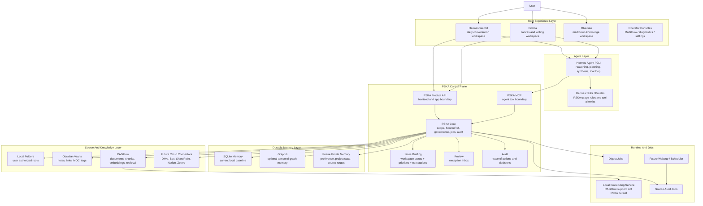
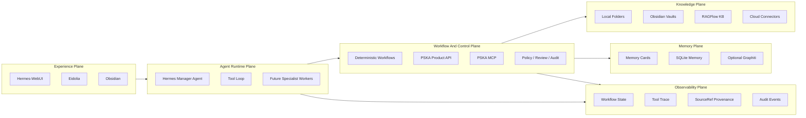
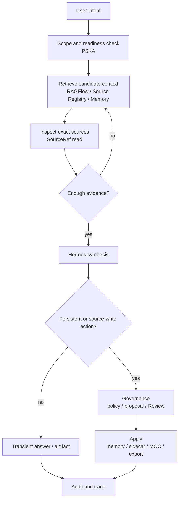
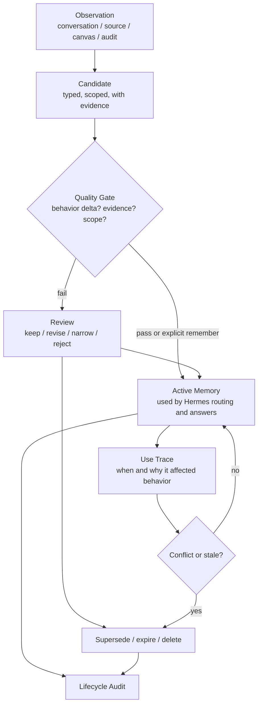

# PSKA Ecosystem Architecture And Vision

更新时间：2026-08-12

本文描述的不是单个 PSKA-Essential 仓库，而是当前这一整套个人 AI 工作系统：
Hermes-WebUI、Hermes Agent、Eidolia、PSKA-Essential、RAGFlow、Obsidian、本地
文件夹、Memory/Review、jobs/scheduler，以及后续可能接入的 MCP、插件、云端资料源和
桌面工具。

一句话 vision：

> 这套系统要成为一个 source-first、memory-governed、agent-operated 的个人知识与创作
> 工作空间。Hermes 像助理一样行动，PSKA 像控制塔一样管边界、证据和记忆，Obsidian、
> 本地文件夹、RAGFlow 和未来云端资料源保留各自擅长的数据职责。

## Executive Picture

当前系统不是一个“大一统 app”，而是一个可组合的 AI workspace。



最重要的设计判断：

- Hermes 是唯一主要 reasoner 和 agentic loop 执行者。
- PSKA-Essential 不做 Chat，不拥有生成 LLM，不直接替用户回答。
- PSKA-Essential 是控制面：scope、权限、SourceRef、Review、Memory、Audit、jobs。
- RAGFlow 是重文档解析和知识库检索后台，不是最终回答者。
- Obsidian 和本地文件夹是一等 personal source，不是 memory backend。
- Memory 不是泛泛的用户画像摘要，而是会改变未来行为的 governed card。
- Eidolia 和 PSKA 都优先保持小对象模型：thought/artifact 是创作对象；belief、
  decision、memory、route 是投影和状态，不急着拆成一堆新节点。
- 所有能长期影响系统行为或改用户源文件的动作，都要有权限、证据、审计和可撤销路径。

## Reference Architectures We Borrow From

外部 agentic 系统的调研结论不是“照抄一个框架”，而是抽取几个稳定范式，然后映射到
当前组件集合。

| 外部范式 | 核心思想 | 我们如何吸收 |
| --- | --- | --- |
| OpenAI Agents SDK | Runner loop 调 LLM、tools、handoffs、guardrails、sessions、tracing | Hermes 是 runner/manager；PSKA MCP 是工具边界；未来 specialist agent 作为 handoff/tool，而不是让 PSKA 自己变成 agent runtime |
| Anthropic Effective Agents | 区分 deterministic workflow 和 autonomous agent；常见模式包括 routing、orchestrator-workers、evaluator-optimizer | PSKA ingest/review/source write/memory apply 是 deterministic workflow；Hermes research/synthesis/writing 是 agentic loop |
| LangGraph | 用 state graph 表示节点、边、持久状态、human-in-the-loop | PSKA 的 Ask/source organization 可以画成 state machine：scope -> retrieve -> inspect -> decide -> propose/review/apply |
| MCP Host/Client/Server | Host 通过 MCP clients 连接 focused servers；server 暴露工具和资源 | Hermes-WebUI/Hermes 是 host；PSKA 是 focused MCP server；RAGFlow/Obsidian/filesystem 不裸露给 Hermes |
| Agentic Document Workflows | Parse -> Retrieve -> Reason -> Act | RAGFlow/Docling/MarkItDown 负责 parse；PSKA source/RAGFlow 负责 retrieve；Hermes reason；PSKA governance act |
| CrewAI / Microsoft Agent Framework | Flows 控制应用骨架，agents/tools 执行局部任务；强调 state、telemetry、type-safe workflow | 当前不走群聊式 multi-agent；先保留 Hermes-first manager + PSKA control plane，未来再加 specialist workers |

可引用的公开资料：

- [OpenAI Agents SDK](https://developers.openai.com/api/docs/guides/agents)
- [OpenAI Agents SDK: Running agents](https://openai.github.io/openai-agents-python/running_agents/)
- [OpenAI Agents SDK: Agent orchestration](https://openai.github.io/openai-agents-python/multi_agent/)
- [Anthropic: Building Effective Agents](https://www.anthropic.com/engineering/building-effective-agents)
- [LangGraph Workflows and Agents](https://docs.langchain.com/oss/python/langgraph/workflows-agents)
- [LangGraph Graph API](https://docs.langchain.com/oss/python/langgraph/graph-api)
- [MCP Architecture](https://modelcontextprotocol.io/specification/2025-06-18/architecture)
- [OpenAI MCP and Connectors](https://developers.openai.com/api/docs/guides/tools-connectors-mcp)
- [CrewAI documentation](https://docs.crewai.com/)
- [Microsoft Agent Framework overview](https://learn.microsoft.com/en-us/agent-framework/overview/)

这些参考给我们一个更标准的系统图：不是“一个 agent 加一个 RAG”，而是六个平面共同
组成可治理的 agentic workspace。



对应到实现原则：

- Agent runtime 可以开放，control plane 必须保守。
- 工具调用可以多，source writes 和 durable memory writes 必须少而清楚。
- 对话可以流式，治理和审计必须结构化。
- Specialist workers 可以逐步引入，但不能绕过 Hermes/PSKA 的 scope 和 policy。
- Human-in-the-loop 不是所有动作都卡 Review，而是高风险、持久化、冲突和源文件写回才进入治理。

### Canonical Agentic Loop

面向展示时，可以把 Hermes + PSKA 的 agentic loop 画成下面这条线：



这条 loop 明确了我们和普通 RAG chatbot 的差别：检索不是终点，回答不是唯一产物，持久化
必须经过治理。

## Product Vision

用户最终感受到的不是“我又装了一个 RAG 工具”，而是：

```text
我给系统几个资料源。
它知道哪些材料在哪里，哪些可靠，哪些重复，哪些需要整理。
我问问题时，它先查证据，再由 Hermes 综合。
我让它记住或纠正时，它能把这件事变成有边界的记忆。
它能主动提醒我文件夹、知识库、项目状态或记忆里有什么值得处理。
它不会擅自扫全盘、改笔记、删文件或把临时信息永久化。
```

这就是当前所谓 “cos Jarvis” 的产品标准：不是炫技的全自动，而是有上下文、有边界、
有证据、有记忆、有下一步建议的个人助理。

## System Roles

| 组件 | 当前角色 | 长期角色 | 不应该做什么 |
| --- | --- | --- | --- |
| Hermes-WebUI | 日常入口、聊天、PSKA panels、Jarvis Bar | 统一个人 AI workspace shell | 不直接调用 RAGFlow/Graphiti/数据库 |
| Hermes Agent | 主要推理、规划、工具循环、综合回答 | 多工具个人助理执行层 | 不绕过 PSKA 直接读写 source 或 memory |
| Eidolia | 创作画布、thought/artifact 节点、文档工作区 | 思考、写作、项目结构化工作台 | 不变成第二个 Chat |
| PSKA-Essential | Product API、MCP、治理、SourceRef、Review、Audit | AI knowledge control plane | 不拥有 LLM，不保存原文为 canonical source |
| RAGFlow | 文档解析、chunk、embedding、KB 检索 | 重文档/企业文档知识后台 | 不作为最终回答者或 memory provider |
| Obsidian | Markdown vault、links、MOC、人工知识整理 | 一等个人知识 source 和写作空间 | 不承担 PSKA Review/memory/agent loop |
| Local Folders | 用户真实文件系统资料源 | local-first personal source layer | 不被默认全盘扫描 |
| SQLite Source Registry | metadata、FTS5、hash、links、annotations | 可重建 source index 和轻治理层 | 不成为原文仓库 |
| SQLite Review | 当前 review store | governance exception inbox | 不成为日常所有操作的阻塞点 |
| SQLite Memory | 当前轻量 durable memory | local personal memory baseline | 不保存每个 chunk/note/chat |
| Graphiti | 可选图记忆 provider | temporal/event/relationship memory | 不阻塞主路径 |
| Local Embedding | RAGFlow 支撑服务 | heavy retrieval enhancement | 不成为 local source 第一版前提 |
| Codex Skills/Plugins | 开发、自动化、外部连接能力 | 可扩展工具生态 | 不替代 PSKA 的权限和审计边界 |

## Three Kinds Of Knowledge

系统必须区分三类知识，否则所有组件都会互相污染。

| 类型 | 例子 | 所在位置 | 治理要求 |
| --- | --- | --- | --- |
| Source Knowledge | PDF、Markdown、Obsidian note、代码、邮件、云盘文件 | RAGFlow、本地 folder、Obsidian、未来 connector | 可索引、可读取、可引用，不因读取而进 memory |
| Working Knowledge | 当前问题的检索结果、草稿、brief、画布节点、推理中间产物 | Hermes session、Eidolia project、PSKA workflow artifact | 临时可用，不自动影响未来 |
| Durable Knowledge | 用户偏好、项目边界、纠错、source route、稳定事实 | SQLite Memory、未来 Graphiti/profile memory | 必须有 evidence、scope、behavior_delta、audit |

最容易犯的错是把 source summary 当 memory。PSKA 的原则是：

```text
整篇 note、整份 PDF、一次检索摘要 = source/working knowledge
会改变 Hermes 下一次行为的一句话 = durable memory candidate
```

## Minimal Cognitive Object Model

系统可以有很多视图，但底层对象必须少。PSKA 不应该一开始就把 Belief、Decision、Plan、
Hypothesis、Memory、Task 全部做成互相竞争的实体。第一性对象建议只有五类：

| 对象 | 含义 | 典型来源 | 可以投影成 |
| --- | --- | --- | --- |
| Source | 外部材料和证据 | 文件、Obsidian note、RAGFlow chunk、邮件、网页 | evidence、citation、route |
| Thought | 用户或 agent 正在形成的想法 | 对话、Eidolia 节点、草稿、批注 | belief、question、hypothesis、decision candidate |
| Artifact | 已外化的作品或交付物 | 文档、代码、图、画布输出、MOC | deliverable、draft、version |
| Memory | 会改变未来行为的长期状态 | 明确记住、纠错、review 通过的候选 | preference、project state、source route、correction |
| Trace | 对象之间的时间线和出处关系 | tool call、review、apply、audit、session | decision ledger、belief history、memory lifecycle |

这样 Eidolia 仍然可以只暴露 `thought` / `artifact` 两种节点；PSKA 在背后给 thought
加角色和状态：

```text
Thought(role=belief, evidence=[SourceRef], confidence=..., status=active)
Thought(role=decision, alternatives=..., rejected_options=..., outcome=...)
Memory(from=Thought/Source/Artifact, behavior_delta=..., scope=...)
Trace(subject=Memory, event=superseded_by_correction, source=conversation)
```

Belief And Decision Ledger 不是第六个大系统，而是 `Thought + Trace + SourceRef` 的
时间线视图。Memory Card System 也不是一个“用户小传数据库”，而是从这些对象里筛出来、
能改变未来行为的一小组 governed state。

## Memory Plane In Detail

PSKA 的记忆层要解决的不是“它知道我是什么样的人”，而是：

```text
现在的我怎样变得更聪明？
未来的我怎样恢复上下文？
系统怎样避免把 AI 的推断偷偷写成我的自我定义？
```

因此 Memory Plane 分成四层，由轻到重：

| 层级 | 内容 | 例子 | 写入规则 |
| --- | --- | --- | --- |
| Session Memory | 当前对话和当前任务上下文 | “这轮正在讨论 memory 设计” | 会话内临时存在，不进入 durable memory |
| Working Memory | 当前项目/画布/brief 的活跃上下文 | Eidolia 当前 thought/artifact、PSKA audit briefing | 可被引用和导出，不自动长期化 |
| Durable Memory | 会改变未来行为的卡片 | “问 PSKA 架构先查 architecture docs 和 handoff” | 需要 evidence、scope、behavior_delta、lifecycle |
| Cognitive Model | 从长期轨迹中推断出的思维模式 | “用户常用边界/证据/治理来判断系统设计” | 只能作为解释性 inference，不可直接改写为身份事实 |

这四层的边界很重要：

- Session/Working memory 是上下文，不是人格。
- Durable memory 是行为规则，不是传记。
- Cognitive model 是可质疑的推断，不是“用户就是这样的人”。
- SourceRef 和 Trace 必须把每条记忆带回原始语境，否则十年后只剩一句空洞画像。

### Memory Lifecycle

一条记忆从产生到过期，应该是一条可见生命周期：



关键不是多存，而是会忘、会改、会解释：

- 候选记忆必须能说清楚“下次有什么行为变化”。
- 显式用户纠错优先于旧推断，旧卡片要 `superseded`，不能静默共存。
- 很久没用、只在某项目有效、或来源变得可疑的卡片要进入 refresh/review。
- Hermes 使用某条记忆影响回答时，应记录 use trace，方便未来发现错误记忆的影响范围。

### High-Cognition Mode First

记忆设计的第一目标不是给未来衰退状态做无障碍模式，而是让现在的用户更聪明。所谓
“外挂智能”首先应该是 cognitive amplifier：

| 能力 | 对现在的帮助 | 对未来连续性的帮助 |
| --- | --- | --- |
| Context Booster | 快速恢复一个项目、一次争论、一个设计决定的上下文 | 未来能重建“当时发生了什么” |
| Decision Amplifier | 把证据、备选项、反对理由和后来结果放在一起 | 未来能知道“我为什么这么判断” |
| Memory Sharpener | 把模糊偏好改写成有作用域和行为差异的规则 | 未来不会只剩空泛人格摘要 |
| Thought Expander | 在 Eidolia 里把想法展开、连接、分叉、收束 | 未来能看到思想形成过程，而不只是结论 |
| Continuity Engine | 跨对话自动带回项目边界、路线和纠错 | 未来即使忘了细节，也能找回自己的轨迹 |

“低认知模式”如果存在，也应该是这套系统自然退化出的 accessibility profile，而不是产品
主叙事。主叙事应是：让 37 岁的用户更锋利、更有上下文、更少重复劳动；同时把这条认知
轨迹保存成未来可以调用的外部连续性。

## Current Baseline

截至 2026-08-13，当前可验证的系统状态是 M19 source governance baseline。

| 能力 | 当前状态 |
| --- | --- |
| Hermes-WebUI 日常入口 | 已作为主入口，PSKA panel/Jarvis Bar/Sources panel 正在接入 |
| Hermes Agent | 已作为主要生成/推理/agentic loop 执行层 |
| Eidolia | 已通过 Hermes CLI 执行 direct/agentic thought generation |
| PSKA Product API | 已提供 health、capabilities、workspace status、ask、review、memory、sources、jobs |
| PSKA MCP | 已暴露 KB、Ask、Review、Memory、Source、Jarvis、jobs 等工具 |
| RAGFlow | 作为 KB/retrieval backend 保留 |
| SQLite Memory + Review | 当前轻量闭环可用 |
| Personal Source Layer | 已支持 local folder/Obsidian root、scan、FTS5 search、read、neighbors |
| Source Search | 已支持 BM25、title/path/heading boost、match reason、highlighted snippet、LIKE fallback |
| Source Audit | 已支持 duplicate preview、unresolved links、unlinked notes、source-route candidates |
| Duplicate Reports | 已支持 exact hash、fclones/Czkawka hash、内置 size/name/version heuristic、indexed text similarity、duplicate review list/mark，以及 dry-run cleanup proposal |
| Source Audit Jobs | 已支持 enqueue/list/run、due tick、recurring cadence |
| Obsidian MOC | 已支持 proposal/apply，只写 PSKA-managed marker block，并支持 folder/tag/topic/project 分组 |
| Obsidian Frontmatter Tags | 已支持显式 `obsidian_frontmatter` tag proposal/apply，只追加去重 `tags` |
| Obsidian Markdown Comments | 已支持显式 `obsidian_markdown_comment` comment proposal/apply，只追加 PSKA Comment block |
| Source Collections | 已支持命名集合，保存显式 SourceRef 或无 embedding search selector，并展开为 ContextPacket |
| Jarvis Briefing | 已聚合 workspace、source audit、memory/review cues、next actions |
| Governance | memory 和 source write 都走 proposal/apply/review/audit 边界 |

验证基线见外部交接文件：

- [HANDOFF.md](/Users/xudawei/Documents/Codex/2026-07-27/yi/HANDOFF.md)

## User Experience Surfaces

### Hermes-WebUI

Hermes-WebUI 是主入口。它承担：

- 对话和 session；
- PSKA scope chip；
- Home/Jarvis Bar；
- Knowledge panel；
- Sources panel；
- Review/Activity/Settings；
- MCP 工具可见性；
- 未来文件、日历、邮件、任务等 workspace shell。

用户在这里说话，Hermes 决定是否调用 PSKA。PSKA panel 提供可见状态和安全动作。

### Eidolia

Eidolia 是创作和思考画布。它承担：

- thought/artifact 节点；
- 文档和项目工作区；
- 显式输入节点；
- direct generation；
- Hermes agentic loop；
- 证据 artifact；
- 后续多节点写作、研究、推演。

Eidolia 不应该变成另一个聊天系统。它应该把生成结果落在节点和文档里。

### Obsidian

Obsidian 是用户已有的 Markdown 知识空间。它承担：

- 手写笔记；
- links/backlinks；
- frontmatter/tags；
- MOC/index note；
- vault 内知识组织。

PSKA 对 Obsidian 的正确态度是“尊重原生笔记”，不是“把 vault 变成数据库”。当前 MOC
writeback 已经按这个原则实现：只改 PSKA marker block。

### Provider Consoles

RAGFlow、Graphiti、embedding 服务、未来 connector admin UI 都可以保留自己的专业控制台。
PSKA 只在日常用户路径上提供统一状态和跨组件 workflow，不重做每个专业系统的完整 UI。

## Runtime Interaction Patterns

### 1. Chat With Knowledge

```text
User question
  -> Hermes-WebUI
  -> Hermes Agent
  -> PSKA MCP tools
  -> PSKA scope/readiness/retrieval/memory
  -> RAGFlow or local sources
  -> Hermes synthesis
  -> answer with evidence
```

要点：

- LLM 只在 Hermes。
- PSKA 不生成最终回答。
- Scope 必须明确。
- 证据不足时应返回 insufficient context，而不是编。

### 2. Local Folder / Obsidian Query

```text
authorized root
  -> scan metadata, text, headings, links, hashes
  -> SQLite FTS5 / BM25
  -> source_search
  -> source_read / neighbors
  -> Hermes synthesis
```

这是无 embedding RAG 的主路径。它解决的是 To C 用户真实文件夹：

- 文件在哪；
- 哪些文件重复；
- 哪些 note 孤立；
- 哪些 link 断了；
- 哪些 source route 值得记；
- 哪些 tag/comment/MOC 可以建议写回。

### 3. Heavy Document Ingestion

```text
upload files
  -> PSKA Product API
  -> RAGFlow dataset/documents
  -> parsing/chunking/embedding/indexing
  -> readiness
  -> Ask / digest / source read
```

RAGFlow 适合 PDF、长文档、需要 chunk 和 embedding 的知识库。PSKA 不绕过 RAGFlow
直接管理 chunk，也不把 RAGFlow 的 provider-native 状态泄露给前端和 agent。

### 4. Memory Change

```text
remember / correct / forget
  -> Hermes interprets user intent
  -> PSKA memory change tool
  -> policy
  -> auto apply or Review
  -> SQLite Memory / future Graphiti
  -> audit
```

合格 memory 必须回答：

```text
下次 Hermes 会因此做什么不同？
这条记忆作用于哪个 scope？
证据在哪里？
冲突时如何覆盖或淘汰？
```

### 5. Source Organization

```text
source audit
  -> duplicate/link/orphan/route findings
  -> next_actions
  -> tag/comment/MOC proposal
  -> sidecar/native apply only when permitted
  -> audit
```

当前已实现：

- tag/comment apply 写 `.pska/annotations.jsonl` sidecar；
- Obsidian tag apply 可在 `native_write/managed` vault 中显式写 YAML frontmatter `tags`；
- Obsidian comment apply 可在 `native_write/managed` vault 中显式追加 PSKA Comment block；
- Obsidian MOC apply 写目标 note 的 PSKA marker block；
- Source collections 可保存手动 SourceRef 或搜索 selector，并按需展开成 retrieval context；
- Source search 可输出 match reason、rank boost 和 highlighted snippet；
- duplicate report 不删除、不移动、不合并。

### 6. Proactive Jarvis Loop

```text
workspace status
  + source audit
  + due jobs
  + memory/review cues
  -> pska_jarvis_briefing
  -> Hermes next actions
  -> user confirmation or safe execution
```

Jarvis 体验不等于后台偷偷行动。它的第一形态是“把该注意的事摆到台面上，并给出安全下一步”。

## Data Ownership And Boundaries

| 数据 | Canonical owner | PSKA 是否可缓存 | PSKA 是否可写 |
| --- | --- | --- | --- |
| 原始 PDF/文档 | RAGFlow 或用户文件夹 | 只缓存 metadata/source refs | 不直接改 |
| RAGFlow chunks/embeddings | RAGFlow | 不做 authoritative copy | 通过 adapter 请求 |
| Obsidian notes | Obsidian vault | 可索引 metadata/text/links | 只经 proposal/apply 改 marker block 或未来 native metadata |
| 本地文件 | 用户授权 root | 可索引 metadata/text/hash | 默认不改，sidecar 或 explicit native only |
| Source annotations | PSKA sidecar | 是 | 根据 permission 写 `.pska` |
| Workflow artifacts | PSKA workflow store/Eidolia | 是 | 是 |
| Review decisions | PSKA Review | 是 | 是 |
| Durable memory | SQLite Memory / Graphiti / future provider | 只存 provider-facing envelope | 经 governance 写 |
| Audit events | PSKA Audit | 是 | 是 |

设计底线：

- Source of truth 留在用户和专业组件那里。
- PSKA 持有的是控制记录、索引、出处、治理和审计。
- Provider 可以替换，公共 MCP/Product API contract 不应该变。

## Existing And Envisioned Components

### Already In The System

| 组件 | 价值 |
| --- | --- |
| Hermes-WebUI | 日常入口，保留成熟聊天、session、settings、MCP 可见性 |
| Hermes Agent/CLI | 统一推理与工具 loop，减少多 agent 混乱 |
| Eidolia / novel / InfinityCanvas | 创作画布、节点工作区、文档生成实验 |
| PSKA-Essential | 统一 Product API、MCP、Review、Memory、SourceRef、Audit |
| RAGFlow | 文档解析、chunk、embedding、retrieval |
| SQLite stores | 本地 review/memory/source/jobs/audit 基线 |
| Obsidian vault support | local-first Markdown knowledge source |
| Local embedding service | 支撑 RAGFlow heavy retrieval |

### Near-Term Additions

| 方向 | 目的 |
| --- | --- |
| Duplicate heuristics refinements | 已有同名、版本号、近似大小、indexed-text similarity、基础审阅工作台和 dry-run 清理提议；后续扩展媒体候选与可执行强确认 |
| Obsidian native metadata write | frontmatter richer fields |
| MOC grouping refinements | 已有 folder/tag/topic/project first-pass；后续接 richer metadata 和用户规则 |
| System wakeup/tick | 到期 source audit/digest job 的系统级触发 |
| Better agentic scope | Eidolia explicit_inputs / connected_component / workspace 三档 |
| Memory quality UI | 显示 behavior_delta、scope、evidence、last used、conflict status |

### Later Platform Extensions

| 方向 | 位置 |
| --- | --- |
| Google Drive / Box / SharePoint | cloud source providers |
| Notion / Zotero | vertical source providers |
| Gmail / Outlook / Calendar | activity and communication sources, usually read-mostly |
| MarkItDown / Docling / Tika | text extraction workers |
| OCRmyPDF | scanned PDF preprocessing |
| Recoll / Tantivy / Xapian | stronger local lexical index adapters |
| Czkawka / dupeGuru / rmlint | dry-run duplicate and cleanup adapters |
| Graphiti | optional temporal memory and relationship layer |
| Browser/desktop automations | user-approved action execution, not hidden state mutation |

## Why This Architecture Matters

单纯 RAG 系统的问题：

- 把所有文件导入一个知识库，source ownership 模糊；
- embedding 出问题时，整个系统不可用；
- 记忆容易变成漂亮但无行为差异的摘要；
- agent 容易直接调用底层工具，权限和审计散掉；
- 前端容易变成 provider 控制台拼盘。

当前架构的回答：

- Source-first：先保留用户文件和 provider 的 canonical ownership。
- Metadata-first：PSKA 索引、SourceRef、audit 可重建，不接管原文。
- Governance-first：长期记忆和源文件写回必须有 evidence、scope、policy。
- Hermes-first：一个主要 agent 做推理和工具 loop，避免多个回答者互相抢权。
- Component-first：RAGFlow、Obsidian、Eidolia、Hermes 各做擅长的事。

## The Jarvis Standard

系统达到“像 Jarvis”不是因为它会说漂亮话，而是因为它能做到这些：

1. 用户问项目状态时，它先查 workspace status、handoff、git、source audit 和 memory。
2. 用户问材料问题时，它先查 source，再让 Hermes 综合。
3. 用户让它记住时，它生成带 behavior_delta 的 Memory Card。
4. 用户让它整理文件时，它先给 audit 和 proposal，不直接动文件。
5. 用户的 Obsidian vault 不被破坏，写回只发生在明确授权的块或 metadata 上。
6. 用户不用记住每个组件在哪，Hermes/Jarvis 会把下一步安全动作呈现出来。
7. 系统能解释每条答案、记忆、整理建议来自哪里。
8. 系统能逐渐主动：到期 audit、digest、重复文件、断链、待复核记忆都会浮出水面。

## North-Star Workflows

### Personal Research

```text
Drop files or register folders
  -> PSKA scans and checks readiness
  -> Hermes asks through PSKA
  -> sources are inspected
  -> answer becomes brief
  -> stable route or correction becomes Memory Card
```

### Writing And Thinking

```text
Eidolia canvas
  -> explicit input nodes
  -> Hermes direct or agentic run
  -> PSKA evidence when needed
  -> generated thought/artifact
  -> optional export or memory review
```

### Personal File Governance

```text
Register local folders and Obsidian vaults
  -> source audit jobs
  -> duplicate/link/orphan/route findings
  -> saved searches
  -> sidecar tags/comments
  -> governed Obsidian MOC
```

### Personal Memory Maintenance

```text
Conversation correction or remember request
  -> Hermes calls PSKA memory tool
  -> policy decides auto apply vs Review
  -> durable memory lifecycle
  -> future answer behavior changes
```

## Open Design Questions

- Obsidian native write 到底先做 frontmatter tag，还是 markdown comment？
- 近似查重下一步优先媒体候选，还是先做 move/delete/merge proposal 的可执行强确认流程？
- Jarvis wakeup 是由 Codex/系统 automation 触发，还是 Product API 自带轻 scheduler？
- Cloud connectors 的 source roots 是否和 local roots 使用同一套 SourceRef？
- Graphiti 在个人版中是否只做 optional temporal memory，而不是默认启动项？
- Hermes-WebUI 的 PSKA chip 应何时从 hidden context injection 迁移到结构化 turn scope？
- Eidolia agentic scope 默认应该是 explicit_inputs、connected_component，还是 workspace？

## Desired End State

最终系统应该像这样工作：

```text
Hermes-WebUI 是入口。
Hermes 是行动者。
Eidolia 是创作空间。
Obsidian 和文件夹是用户真实知识地形。
RAGFlow 是重文档引擎。
PSKA 是控制塔。
Memory 是经过治理的行为状态。
Audit 是系统可信度的账本。
```

用户不需要理解这些组件。用户只会感觉到：

```text
我的材料没有被吞掉。
我的笔记没有被乱改。
我的长期偏好和项目边界真的被记住了。
回答能追溯。
系统会告诉我下一步该处理什么。
我可以让它做事，但它知道什么时候该先问我。
```
