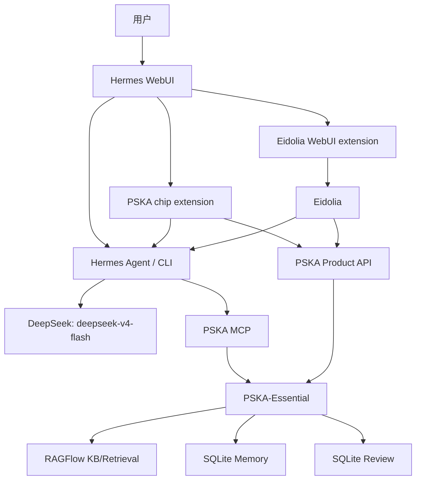

# PSKA 系统交互模型

本文定义当前收敛后的 PSKA 系统边界。它描述 Hermes WebUI、Eidolia、
PSKA-Essential、RAGFlow、memory 和 review 之间的真实交互路径，以及每条路
使用的 LLM 来源。

当前可演示系统的冻结基线见
[`DEMO_BASELINE_2026-08-03.zh.md`](DEMO_BASELINE_2026-08-03.zh.md)。本文
继续作为交互路径和职责边界的规范说明。

## 核心规则

1. Hermes 是唯一日常 Reasoner。

   Hermes 负责理解问题、规划工具调用、综合证据、生成回答、创作草稿、判断
   是否需要写入记忆或发起 review。

2. PSKA 不做 chat，也不拥有生成 LLM。

   PSKA-Essential 是知识治理胶水层。它负责 scope、路由、证据、来源、review、
   memory 生命周期、审计和 provider 抽象。它可以返回 context、brief、artifact
   和状态，但不应该直接调用 LLM 生成最终回答。

3. RAGFlow 是文档库和检索后台，不是回答者。

   即使 RAGFlow 自带 LLM/chat 能力，PSKA 系统内也只把它作为 KB、解析、chunk、
   embedding、indexing 和 retrieval provider。最终回答由 Hermes 完成。

4. Digest 走 Hermes。

   PSKA 可以创建 digest job、检查 KB readiness、保存 artifact、创建 review
   candidate 和审计记录；真正的总结、筛选和解释应由 Hermes 经 PSKA MCP 完成。

5. WebUI chip 只提供 turn scope。

   PSKA chip 不回答、不替 Hermes 检索、不写记忆。它只负责开关、数据集选择、
   document scope、模式和 token 参数，然后把这些参数随下一次 query 提供给
   Hermes，让 Hermes 判断是否调用 PSKA MCP。

6. Eidolia 是创作画布，不是第二个聊天入口。

   Eidolia 只需要长期保存 thoughts 和 artifacts。创作推演走 Hermes；证据抓取
   可以直接走 PSKA Product API，但这种路径只产出 evidence artifact，不产出
   Hermes 风格回答。运行方式应作为节点动作或 action preset，而不是第三类画布节点。

## 组件职责

| 组件 | 职责 | 当前 LLM 来源 |
| --- | --- | --- |
| Hermes WebUI | 日常入口、聊天 UI、extension 容器、Kanban/Tasks 投影视图 | 不直接决定内容；交给 Hermes runtime |
| Hermes Agent/CLI | 唯一日常推理和生成执行层 | `deepseek` / `deepseek-v4-flash`，来自 `~/.hermes/config.yaml` |
| Eidolia | 创作画布、项目工作区、thought/artifact 编排和节点运行 | 生成和 agentic run 通过 Hermes CLI，默认继承 Hermes 模型 |
| PSKA-Essential Product API | 状态、scope、readiness、retrieval probe、review、memory、jobs | 无生成 LLM |
| PSKA-Essential MCP | Hermes 调用 PSKA 的工具面 | 无生成 LLM；工具结果由 Hermes 综合 |
| RAGFlow | 文档库、解析、chunk、embedding、retrieval | 只使用 embedding/indexing；具体 embedding/indexing provider 由 RAGFlow dataset 配置 |
| SQLite Memory | 当前轻量 memory provider | 无 LLM |
| SQLite Review | 当前轻量 review store | 无 LLM |
| Graphiti | 可选未来图记忆 provider | 当前不是主路径 |

当前本机主要地址：

| 服务 | 地址 | 说明 |
| --- | --- | --- |
| Hermes WebUI | `0.0.0.0:8787` | 可被局域网访问，已有访问密码 |
| Eidolia | `127.0.0.1:8797` | 只给本机/WebUI sidecar 访问 |
| PSKA Product API | `127.0.0.1:8765` | 只给本机/WebUI sidecar/Eidolia backend 访问 |
| RAGFlow API | `127.0.0.1:9380` | PSKA adapter 后台使用 |

## 总体图



## 交互路径

### 1. WebUI 普通聊天

```text
用户
  -> Hermes WebUI /api/chat/start
  -> Hermes Agent
  -> configured LLM
```

LLM 来源：Hermes 配置，当前是 `deepseek-v4-flash`。

PSKA 是否参与：默认不强制参与。Hermes 可以在需要时调用已配置的 MCP 工具。

### 2. WebUI 打开 PSKA chip 后提问

```text
用户打开 PSKA chip 并选择 scope
  -> chip 将 enabled/mode/dataset_ids/document_ids/max_tokens 附加到下一次 turn
  -> Hermes WebUI /api/chat/start
  -> Hermes Agent
  -> PSKA MCP
  -> PSKA-Essential
  -> RAGFlow / SQLite Memory / SQLite Review
  -> Hermes 综合回答
```

LLM 来源：Hermes。PSKA 只返回工具结果。

当前实现说明：chip 现在通过 WebUI extension 包装 `window.send` 和 `window.api`，
在下一次 `/api/chat/start` 里注入 skill/context 文本，并在显示层隐藏该注入。
这是当前可用桥接方式。长期目标是改为结构化 turn scope，而不是靠隐藏文本。

2026-08-03 demo baseline 中，WebUI 财报问题已经能把选中知识库 scope 传给
Hermes，并在 PSKA audit 中留下 scoped retrieval/probe 记录。它满足当前 demo
要求，但不应误解为 WebUI 每次都会强制跑完整 PSKA agentic loop。

### 3. WebUI chip 的状态、Probe、Kanban、Tasks

```text
WebUI extension
  -> /api/extensions/pska-mini/sidecar/...
  -> PSKA Product API
  -> PSKA-Essential
  -> RAGFlow / SQLite
```

LLM 来源：无。

用途：

- 展示 PSKA health、diagnostics、workspace status。
- 展示和选择 RAGFlow dataset scope。
- 做 lightweight retrieval probe。
- 将 PSKA Review 投影到 Hermes Kanban。
- 创建 Hermes Task 作为 digest runner 入口。

这些都是管理/投影视图，不是 PSKA chat。

### 4. WebUI 打开 Eidolia

```text
Hermes WebUI
  -> Eidolia extension
  -> /api/extensions/eidolia/sidecar/
  -> Eidolia local service
```

LLM 来源：无。这里只是打开创作工作区。

Eidolia 监听 `127.0.0.1` 时，局域网用户不能直接访问 `127.0.0.1:8797`。应通过
WebUI extension sidecar 打开，否则远端浏览器里的 `127.0.0.1` 指向远端用户自己的
机器。

### 5. Eidolia 普通创作生成和念头推演

```text
Eidolia UI
  -> Eidolia backend /api/agent/runs
  -> Hermes CLI
  -> configured LLM
  -> novel-local MCP + pska-essential MCP
  -> candidate
  -> CanvasPatch
  -> Workspace
```

LLM 来源：Hermes CLI，默认继承 `~/.hermes/config.yaml`。

这条路用于：

- 生成草稿。
- 推演 thought。
- 重写、分析、审计、提交候选。
- 需要时让 Hermes 调用 PSKA MCP 查证据。

### 6. Eidolia 取 PSKA 证据

当前 UI/代码里的 legacy 名称是 `Ask PSKA`，但语义应改为：

```text
Fetch PSKA Evidence
```

真实路径：

```text
Eidolia UI
  -> Eidolia backend /api/pska/retrieval-probe
  -> PSKA Product API /api/runtime/retrieval-probe
  -> PSKA-Essential
  -> RAGFlow
  -> artifact/evidence node
```

LLM 来源：无。

这条路只做只读 evidence retrieval。它不走 Hermes，不生成最终回答，不写 memory，
不创建 review。输出应是 `artifact/evidence`，不是 `thought`。

### 7. Eidolia 让 Hermes 带 PSKA 回答或创作

这是目标上的另一条路径，应独立命名：

```text
Ask Hermes With PSKA
```

目标路径：

```text
Eidolia UI
  -> Eidolia backend /api/agent/runs
  -> Hermes CLI
  -> PSKA MCP
  -> PSKA-Essential
  -> RAGFlow / Memory / Review
  -> Hermes 输出 thought 或 draft artifact
```

LLM 来源：Hermes。

它和 `Fetch PSKA Evidence` 的区别是：这里由 Hermes 综合和推理，PSKA 只提供
工具和证据。

### 8. Memory

日常记忆变更路径：

```text
用户在 WebUI/Hermes 对话中说 remember/correct/forget
  -> Hermes 判断操作类型
  -> pska_memory_change_from_conversation
  -> PSKA governance
  -> SQLite Memory
  -> audit
```

LLM 来源：Hermes 负责判断和组织变更请求；PSKA 负责治理和写入。

当前策略：

- clear conversation memory change 可以 auto apply。
- uncertain、risky、conflicting、batch-derived 或用户明确要求 review 时进入
  Review。
- Review 是异常收件箱，不是日常记忆编辑器。

### 9. Review

```text
PSKA Proposal
  -> SQLite Review
  -> Hermes WebUI Kanban projection
  -> human decision
  -> PSKA memory apply/update/delete
  -> SQLite Memory
```

LLM 来源：无。若需要解释或摘要 review 内容，由 Hermes 调工具后说明。

Kanban 只是投影视图，PSKA Review store 是权威来源。

### 10. Digest

目标路径：

```text
Hermes Task / user command
  -> Hermes Agent
  -> PSKA MCP digest/readiness/retrieval tools
  -> PSKA-Essential
  -> RAGFlow
  -> Hermes 生成 digest artifact
  -> PSKA 保存 artifact / 可选 review candidate
```

LLM 来源：Hermes。

PSKA 不应自己调用 LLM 做 digest。RAGFlow 也不作为 digest 回答者。

## Eidolia 节点分类

Eidolia 应收敛为两类长期节点：

| kind | 含义 | 例子 |
| --- | --- | --- |
| `thought` | 念头、疑问、假设、推演中结论 | idea、question、inference |
| `artifact` | 有来源、生成记录或可交付形态的产物 | chapter、draft、material、source、evidence、digest |

不再新增 `operator` 节点 kind。thought 和 artifact 都可以被运行，运行方式由按钮、
菜单或 action preset 表达。

`Ask PSKA` 不应该作为 thought。如果保留一个可见的 Ask PSKA 配置卡，它应归类为
`artifact/evidence_query` 或兼容旧数据的 `artifact/ask_pska`；运行结果归类为
`artifact/evidence`。

建议命名：

| 当前/旧动作 | 建议动作名 | 输入 | 输出 | LLM |
| --- | --- | --- | --- | --- |
| `Ask PSKA` | `Fetch PSKA Evidence` | thought/question + selected scope | `artifact/evidence` | 无 |
| 新增 | `Ask Hermes With PSKA` | thought/artifact + selected scope | `thought` 或 `artifact/draft` | Hermes |

## 路由准则

允许直连 PSKA Product API 的场景：

- health/status/diagnostics。
- dataset list、readiness、ingestion status。
- source read。
- review list/get/decision projection。
- memory search 或明确的 conversation memory change。
- 只读 evidence artifact 抓取。

必须走 Hermes 的场景：

- 需要自然语言综合回答。
- 需要创作、改写、推演、摘要、解释。
- 需要判断是否调用多个工具。
- 需要将 evidence 转为 thought/draft/digest。
- 需要根据对话语义判断 memory add/update/delete。

不应使用的路径：

- Browser 直接调用 RAGFlow、Graphiti、embedding service 或数据库。
- PSKA 调 RAGFlow chat 来代替 Hermes 回答。
- PSKA 内部直接调用 LLM 生成 answer/digest。
- Eidolia 把 retrieval probe 的结果包装成“AI 回答”。
- WebUI core 因 PSKA 需求产生不可合并的深 fork。

## 当前清理项

1. 将 Eidolia UI 中的 `Ask PSKA` 动作命名逐步改为 `Fetch PSKA Evidence`，保留
   `artifact/ask_pska` 或 `ask_pska` subtype 作为兼容别名。
2. 新增 `Ask Hermes With PSKA` 节点动作，让需要推理/写作的 PSKA 使用场景走
   `/api/agent/runs` 和 Hermes CLI。
3. 将 WebUI chip 的隐藏文本注入升级为结构化 turn scope；在升级前，保持注入内容
   精简、可审计、可关闭。
4. 将 Hermes PSKA skill 分为 daily skill 和 admin skill，避免日常 whitelist 只有
   21 个工具时，skill 文档还提示不可见的 admin 工具。
5. 将 PSKA MCP server 做成 profile 化工具面，例如 `daily` 和 `admin`，避免其他 MCP
   client 直接看到全部 51 个原始工具。

## 一句话定位

```text
Hermes 思考和生成。
PSKA 路由、治理和审计。
RAGFlow 存文档和检索。
Eidolia 组织创作对象。
WebUI 提供日常入口和 extension 容器。
```
